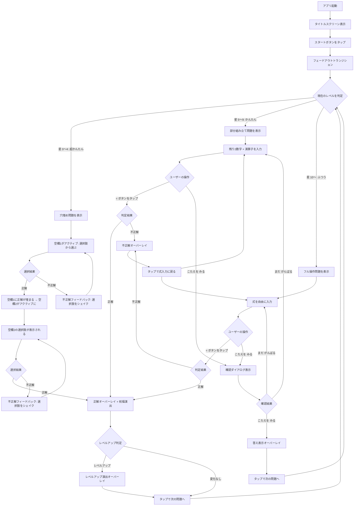
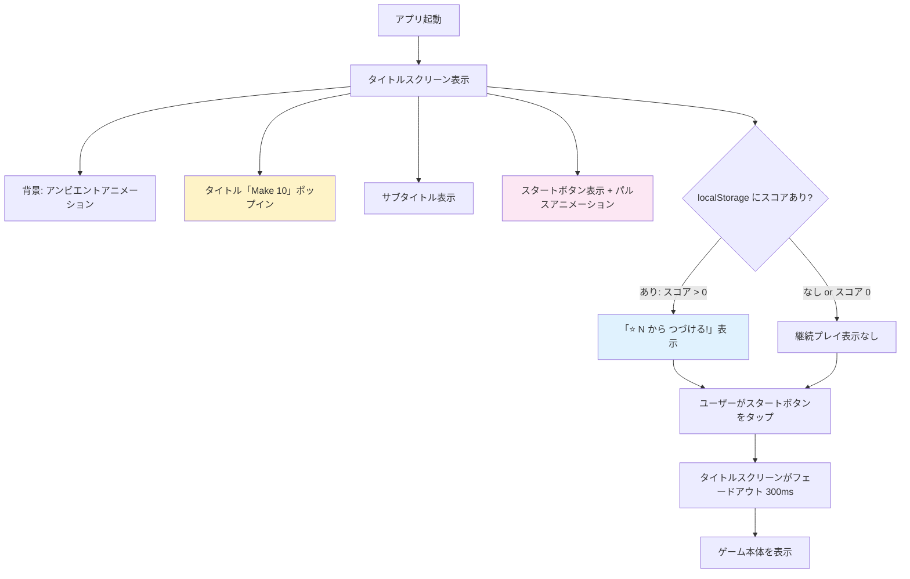
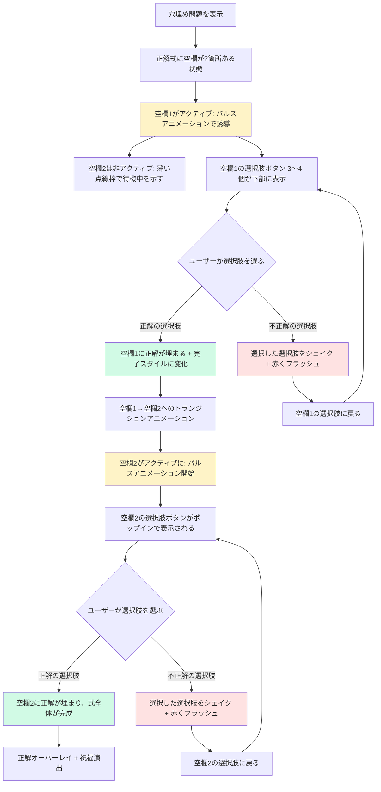
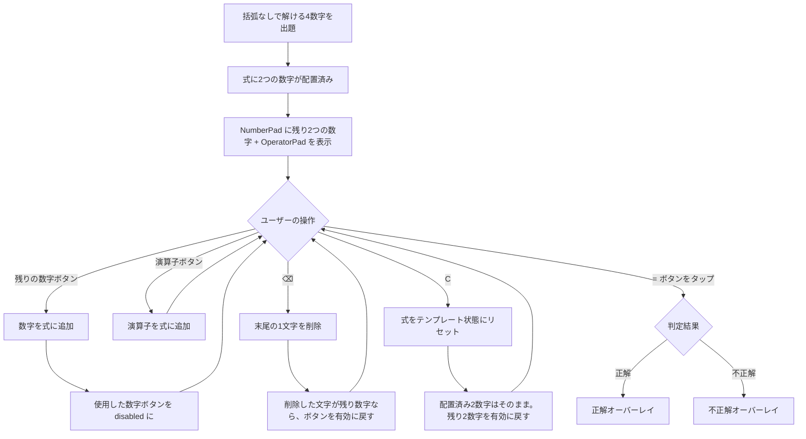
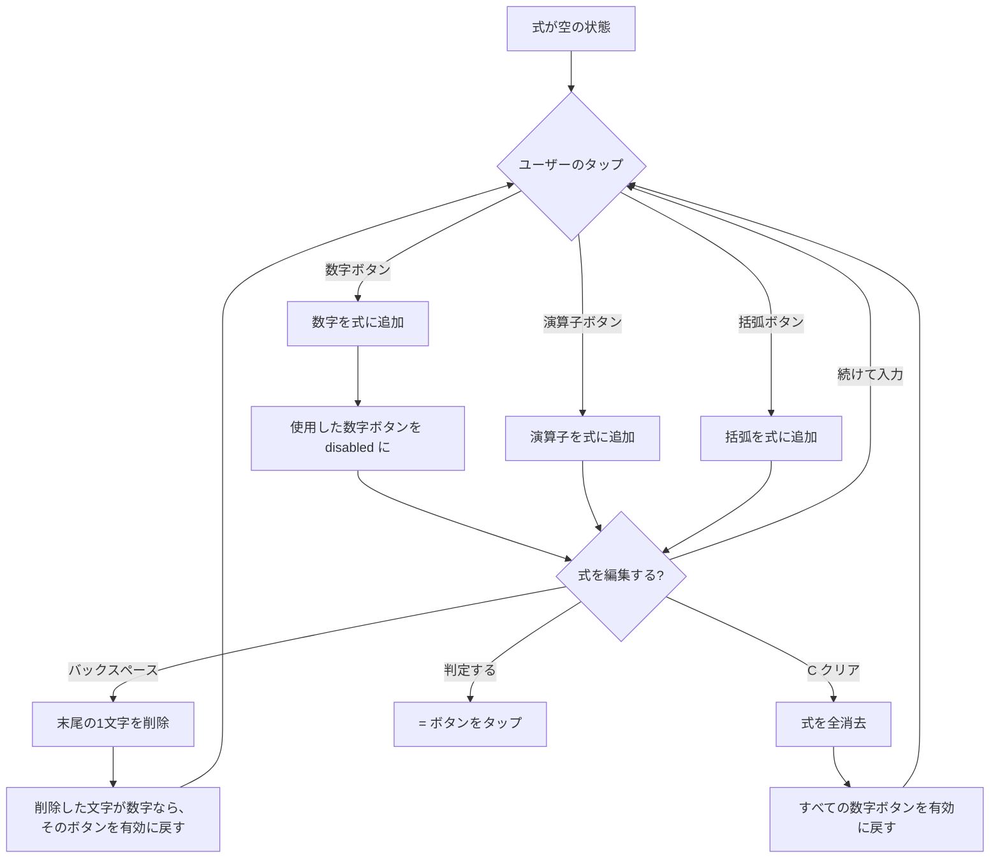
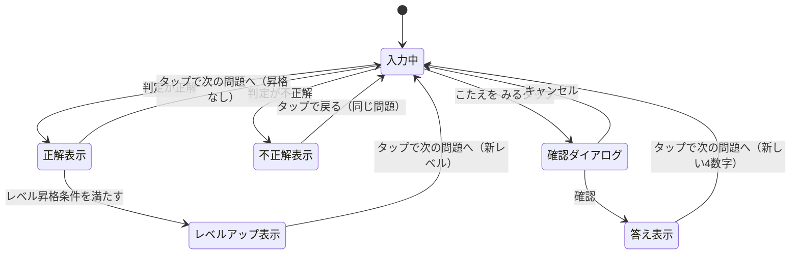
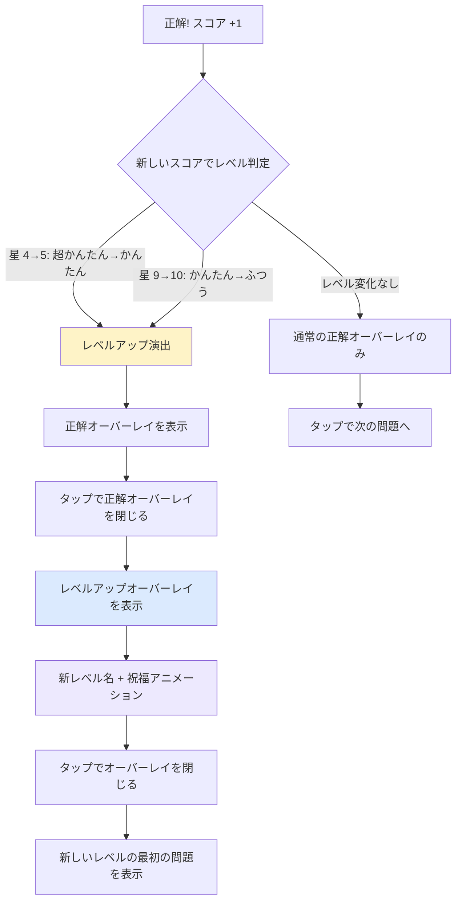
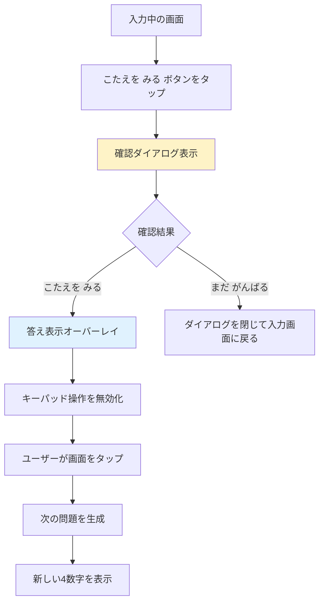
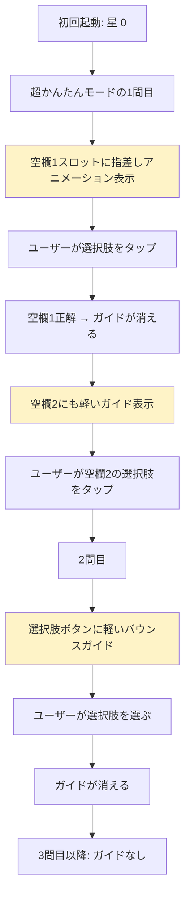

# UX Design: Make 10 UI リデザイン

## 変更履歴

| 版 | 日付 | 内容 |
|----|------|------|
| v1 | - | 初版: ポップ & 子ども向けテーマの UI デザイン |
| v2 | 2026-02-28 | ギブアップ機能、アンビエントアニメーション、入力演出、祝福バリエーション、アイドルアニメーション追加 |
| v3 | 2026-02-28 | 難易度プログレッション（超かんたん / かんたん / ふつう）追加 |
| v4 | 2026-03-01 | ゲーム開始画面（TitleScreen）+ favicon / PWA アイコン刷新 |
| v5 | 2026-03-01 | Level 1 空欄2箇所化 + Level 2 括弧なし限定 |

---

## 1. デザイン原則

### 1.1 明るく、楽しく、安心

子ども（7〜9歳）が「やりたい!」と思えるビジュアル。明るいライトモードベースに、ポップなカラーと柔らかい角丸で親しみやすさを作る。保護者が見ても「安心して遊ばせられる」クリーンなデザイン。

### 1.2 一目でわかる

数字、演算子、コントロールの 3 種類のボタンが配色と形状で即座に区別できる。使用済みの数字は色だけでなく視覚的な変化（取り消し線、縮小）で明確に伝える。

### 1.3 正解が嬉しい

正解時のフィードバックが画面全体で祝福する。紙吹雪、スコアのバウンスアニメーション、励ましメッセージで達成感を最大化する。不正解時は否定せず、前向きに再挑戦を促す。

### 1.4 分からなくても大丈夫（v2 追加）

行き詰まったとき、「こたえを みる」で答えを確認し、学びを得てから次に進める。ギブアップは恥ずかしいことではなく、「勉強になった」と感じられるフレンドリーなトーンを徹底する。

### 1.5 画面が生きている（v2 追加）

操作していない時間帯も、背景のアンビエントアニメーションやアイドル時のボタン揺れで画面が緩やかに動き続ける。「見ているだけで楽しい」感覚を作るが、操作を邪魔しない控えめさを保つ。

### 1.6 できた! から始まる（v3 追加）

初めてアプリを開いた子どもが、最初の問題で「できた!」を体験できる。穴埋め形式から始まり、星を集めるうちに自然とフル操作に到達する。難易度の上昇は「ごほうび」であり「壁」ではない。レベルアップは派手に祝い、成長実感を最大化する。

### 1.7 ワクワクする入口（v4 追加）

アプリを開いた瞬間に「楽しそうなゲームだ」と感じる第一印象を作る。タイトルスクリーンはゲームの世界観への入口であり、スタートボタンは「遊ぶぞ!」のスイッチ。ブラウザタブやホーム画面のアイコンも含め、どこで目にしてもゲームの存在を思い出せるビジュアルアイデンティティを確立する。

### 1.8 なだらかな階段（v5 追加）

難易度の上昇が「壁」ではなく「次の一歩」に感じられるようにする。Level 1 では空欄を2箇所にして「考えて選ぶ」体験を導入し、Level 2 では括弧なしで解ける問題だけを出題して四則演算の基本に集中させる。各レベルの間で「急に難しくなった」と感じさせない、滑らかな難易度カーブを設計する。

### 1.9 ロジックに触れない

UI レイヤーの刷新のみ。`generatePuzzle`、`validator`、`parser` は一切変更しない。

ただし v2 では `useMake10` にギブアップ関連の状態管理を追加し、v3 では難易度レベル状態・レベル別出題ロジック・レベルアップ判定を追加する。v5 では Level 1 の穴埋めロジックを2箇所空欄対応に拡張し、Level 2 の出題フィルタに括弧なし制約を追加する。既存のゲームロジック（正解判定、スコア計算、式パース）には触れない。

---

## 2. ユーザーフロー

### 2.1 メインゲームフロー（v5 更新）



### 2.2 タイトルスクリーンフロー（v4 新規）



ポイント:
- 毎回起動時にタイトルスクリーンを表示する（スキップ機能なし: PRD W14）
- チュートリアルやオンボーディングは含まない（PRD W12）
- カスタムスプラッシュスクリーンではない（PRD W13）。OS のネイティブスプラッシュスクリーンの後にタイトルスクリーンが表示される
- 遷移は React の条件分岐で制御する（ルーティングは追加しない）
- フェードアウトの duration は 300ms（PRD の「300ms 以内に完了」に準拠）
- 継続プレイ表示（S11）は localStorage にスコアが 1 以上存在する場合のみ

### 2.3 超かんたんモードの詳細フロー（v5 更新: 2箇所空欄）



ポイント:
- 空欄は2箇所（演算子または数字の組み合わせ。v5 で1箇所→2箇所に変更）
- 2箇所の空欄は順番に埋める（空欄1を正解してから空欄2に進む）
- アクティブな空欄はパルスアニメーション付きの点線枠で「ここを見て」と誘導
- 非アクティブな空欄（まだ順番が来ていない空欄2）は薄い点線枠で表示し、操作対象でないことを視覚的に伝える
- 空欄1を正解すると、埋まった値が完了スタイル（solid border + 背景色変化）で表示され、空欄2にパルスアニメーションが移る
- 各空欄に対してそれぞれ独立した選択肢セットが表示される（空欄1の選択肢と空欄2の選択肢は異なる）
- 空欄2の選択肢はポップインアニメーションで切り替わり、「次のステップ」感を演出する
- 選択肢は常に表示されている（スロットをタップして表示するのではなく、最初から見える）
- 不正解時はスコア変動なし、同じ空欄で再挑戦
- 2箇所とも正解した時点でスコア +1 および正解フィードバック
- 「こたえを みる」ボタンは非表示（超かんたんでは不要。選択肢から必ず正解を選べるため）
- ギブアップ時は2箇所とも正解を表示する

### 2.4 かんたんモードの詳細フロー（v5 更新: 括弧なし限定）



ポイント:
- v5 変更: 出題する4つの数字は、括弧なし解法が少なくとも1つ存在する組み合わせのみに限定する
- v5 変更: 括弧ボタンは非表示にする（括弧なしで必ず解けるため不要。UI をシンプルにし、子どもが混乱しないようにする）
- 配置済みの2つの数字は NumberPad 上で「使用済み」状態（タップ不可）
- C（クリア）を押すと、配置済み部分を残してユーザー入力部分のみクリアする
- ⌫（バックスペース）は配置済み部分を削除できない
- 判定ロジックはふつうモードと同一（ユーザーが万が一括弧を使った式を入力しても、正解なら受け付ける）

### 2.5 式入力の詳細フロー（ふつうモード、v1 から継続）



### 2.6 フィードバック状態の遷移（v3 更新）



### 2.7 レベルアップフロー（v3 新規）



ポイント:
- レベルアップは正解オーバーレイの後に表示する（正解の喜び → レベルアップの喜びの2段階）
- レベルアップ演出はタップで閉じる（自動で閉じない。子どもが「すごい!」を噛み締める時間を確保）
- レベルダウンはない（PRD W10）

### 2.8 ギブアップフロー（v2 新規、v3 補足）



ポイント:
- スコアは加算しない
- 式が空の状態でもギブアップ可能
- 確認ダイアログは誤タップ防止のため必須
- v3 補足: 「超かんたん」モードではギブアップボタンを非表示にする（選択肢から必ず正解を選べるため不要）
- v3 補足: 「かんたん」「ふつう」モードでは従来通りギブアップ可能

### 2.9 初回ガイドフロー（v5 更新: S9）



ポイント:
- テキスト説明はなし（視覚的な誘導のみ）
- 1問目: 空欄1のスロット付近に指差し（👆）アニメーション + パルスハイライト。空欄1正解後、空欄2にも同様のガイドを短く表示（v5: 2箇所あることを示す）
- 2問目: 選択肢ボタン群が軽くバウンスして「ここから えらんでね」を暗示
- 3問目以降: ガイドなし
- ガイドの表示判定は星の数（0問正解 = 1問目ガイド、1問正解 = 2問目ガイド）

---

## 3. 画面定義

アプリは単一画面構成。ルーティングやページ遷移は存在しない。v4 でタイトルスクリーンを追加するが、React の条件分岐による全画面オーバーレイとして実装する。画面内の領域を 5 つのゾーン + 背景レイヤー + オーバーレイ群 + タイトルスクリーンに分割する。v3 ではレベルに応じてゾーン内のコンポーネントが切り替わる。v5 では Level 1 の穴埋め表示が2箇所空欄に拡張され、Level 2 では括弧ボタンが非表示になる。

### 3.1 タイトルスクリーン（v4 新規）

用途: アプリ起動時にゲームの「顔」を見せ、遊ぶ期待感を高める全画面オーバーレイ

表示条件: アプリ起動時（毎回表示。スキップ不可）

```
+------------------------------------------+
|  [Ambient Background Layer]              |  ← ゲーム本体と同じ背景
|                                          |
|                                          |
|            Make 10                        |  ← タイトル（大きく、グラデーション文字色）
|                                          |
|   4つの すうじで 10を つくろう!           |  ← サブタイトル（ひらがな）
|                                          |
|                                          |
|          ┌──────────────┐                |
|          │   スタート    │                |  ← グラデーションボタン + パルスアニメーション
|          └──────────────┘                |
|                                          |
|        ⭐ 12 から つづける!              |  ← 継続プレイ表示（スコア > 0 の場合のみ）
|                                          |
|                                          |
|                                          |
|          Make 10 Puzzle                   |  ← フッターテキスト（小さく控えめ）
+------------------------------------------+
```

要素:

タイトル「Make 10」:
- フォント: Nunito, font-weight 800 (extrabold)
- サイズ: text-5xl (3rem / 48px)
- カラー: CSS グラデーション文字色（orange-400 → pink-500）。`bg-clip-text text-transparent bg-gradient-to-r from-orange-400 to-pink-500`
- ドロップシャドウ: `drop-shadow(0 2px 4px rgba(0,0,0,0.1))` で奥行きを出す
- 配置: 画面の上から約 30% の位置。`flex` レイアウトで中央配置

サブタイトル:
- テキスト: 「4つの すうじで 10を つくろう!」
- フォント: Nunito, font-weight 600 (semibold)
- サイズ: text-lg (1.125rem / 18px)
- カラー: slate-600
- 配置: タイトルの直下、gap-3（12px）

スタートボタン:
- テキスト: 「スタート」
- フォント: Nunito, font-weight 700 (bold)
- サイズ: text-2xl (1.5rem / 24px)、テキストカラー: white
- 背景: bg-gradient-to-r from-orange-400 to-pink-500（既存の = ボタンと同系統）
- サイズ: 幅 200px、高さ 56px
- 角丸: rounded-2xl (16px)
- シャドウ: shadow-lg shadow-orange-400/40
- 配置: サブタイトルの下、gap-8（32px）
- アニメーション: パルス（scale 1.0 → 1.05 → 1.0 を 2s サイクルで繰り返し。S10）
- active: scale(0.95), transition 100ms
- aria-label: 「ゲームを はじめる」

継続プレイ表示（S11）:
- 表示条件: localStorage に保存されたスコアが 1 以上の場合
- テキスト: 「⭐ {score} から つづける!」
- フォント: Nunito, font-weight 600
- サイズ: text-sm (14px)
- カラー: amber-600
- 配置: スタートボタンの下、gap-3（12px）
- 初回プレイ時（スコア 0）は非表示

フッターテキスト:
- テキスト: 「Make 10 Puzzle」
- サイズ: text-xs (12px)
- カラー: slate-400
- 配置: 画面の最下部、pb-6（24px）

背景:
- ゲーム本体と同じ `bg-gradient-to-br from-amber-100 via-pink-100 to-indigo-100`
- AmbientBackground コンポーネントを共有（同じ浮遊装飾要素）

デコレーション（S10: 浮遊する数字 / 演算子）:
- 背景に 0〜9 の数字と +, -, x, / の演算子を薄く浮遊させる
- 各要素: text-2xl, opacity 0.06〜0.10, ランダムな位置
- AmbientBackground の浮遊要素とは別レイヤー
- アニメーション: 既存の ambient-float キーフレームを再利用、各要素に異なる duration/delay
- 要素数: 10〜12 個以下（パフォーマンス考慮）

レイアウト:
- コンテナ: `fixed inset-0 z-50 flex flex-col items-center justify-center`
- 最大幅: max-w-[428px] mx-auto（ゲーム本体と同じ幅制限）
- コンテンツは垂直方向に中央配置、タイトルがやや上寄りになるよう padding-top を調整

トランジション（タイトルスクリーン → ゲーム本体）:
- スタートボタンをタップすると、タイトルスクリーン全体が opacity 1 → 0 にフェードアウト
- duration: 300ms, timing: ease-out
- フェードアウト完了後に React の状態を切り替え、タイトルスクリーンを DOM から除去
- ゲーム本体は背後に既にレンダリングされているため、フェードアウトと同時に自然に現れる

状態:
| 状態 | 表示内容 |
|------|---------|
| 初回プレイ（スコア 0） | タイトル + サブタイトル + スタートボタン。継続プレイ表示なし |
| 継続プレイ（スコア > 0） | タイトル + サブタイトル + スタートボタン + 「⭐ N から つづける!」 |
| スタートボタンタップ後 | フェードアウトアニメーション中（300ms） |

アクセシビリティ:
- スタートボタンに `aria-label="ゲームを はじめる"` を付与
- デコレーション要素（浮遊する数字・演算子）に `aria-hidden="true"` を付与
- タイトルは `<h1>` タグで適切にマークアップ
- ページ読み込み時にスタートボタンにフォーカスを自動設定

### 3.2 画面レイアウト（縦向き 375px 幅基準、v3 更新）

レベル 3: ふつう（現行と同一）
```
+------------------------------------------+
|  [Ambient Background Layer]              |  ← position: fixed, z-index: 0
|  (浮遊する丸・星・図形)                     |
+==========================================+
|  [Header Zone]                           |  z-index: 10
|  Make 10 ロゴ    レベル表示   スコアバッジ  |  ← v3: レベル名 + プログレス追加
+------------------------------------------+
|                                          |
|  [Display Zone]                          |
|  ┌────────────────────────────────────┐  |
|  │           3 + 5 × _               │  |
|  └────────────────────────────────────┘  |
|                                          |
+------------------------------------------+
|                                          |
|  [Number Pad Zone]                       |
|  ┌──────┐ ┌──────┐ ┌──────┐ ┌──────┐   |
|  │  3   │ │  5   │ │  2   │ │  8   │   |
|  └──────┘ └──────┘ └──────┘ └──────┘   |
|                                          |
+------------------------------------------+
|  [Operator Pad Zone]                     |
|  ┌────┐ ┌────┐ ┌────┐ ┌────┐ ┌──┐ ┌──┐ |
|  │ +  │ │ -  │ │ x  │ │ /  │ │( │ │) │ |
|  └────┘ └────┘ └────┘ └────┘ └──┘ └──┘ |
|                                          |
+------------------------------------------+
|  [Control Pad Zone]                      |
|  ┌────────┐ ┌──────┐ ┌──────┐ ┌──────┐ |
|  │こたえを│ │  ⌫  │ │  C   │ │  =   │ |
|  │ みる  │ │      │ │      │ │      │ |
|  └────────┘ └──────┘ └──────┘ └──────┘ |
+------------------------------------------+
```

レベル 1: 超かんたん（v5 更新: 2箇所空欄）
```
+------------------------------------------+
|  [Ambient Background Layer]              |
+==========================================+
|  [Header Zone]                           |
|  Make 10    ちょうかんたん ⭐ 2           |  ← レベル名 + プログレスバー
+------------------------------------------+
|                                          |
|  [Display Zone — 穴埋めモード]             |
|  ┌────────────────────────────────────┐  |
|  │   3 [☐] 2 + [☐] + 4 = 10        │  |  ← ☐ が空欄スロット（2箇所）
|  │      ↑(active)    ↑(inactive)     │  |  ← 空欄1がアクティブ、空欄2は待機中
|  └────────────────────────────────────┘  |
|                                          |
+------------------------------------------+
|                                          |
|  [Choice Buttons Zone]                   |  ← 空欄1用の選択肢
|                                          |
|  ┌──────────┐  ┌──────────┐             |
|  │    +     │  │    ×     │             |
|  └──────────┘  └──────────┘             |
|  ┌──────────┐  ┌──────────┐             |
|  │    -     │  │    ÷     │             |
|  └──────────┘  └──────────┘             |
|                                          |
+------------------------------------------+
|  [Control Pad Zone — 超かんたん用]        |  ← ギブアップなし、= なし
|  （空。操作不要のため非表示）               |
+------------------------------------------+

空欄1を正解した後:
+------------------------------------------+
|  [Display Zone]                          |
|  ┌────────────────────────────────────┐  |
|  │   3  +  2 + [☐] + 4 = 10         │  |  ← 空欄1は「+」で埋まり完了スタイル
|  │      (filled)     ↑(active)       │  |  ← 空欄2がアクティブに
|  └────────────────────────────────────┘  |
|                                          |
+------------------------------------------+
|  [Choice Buttons Zone]                   |  ← 空欄2用の選択肢に切り替わる
|                                          |
|  ┌──────────┐  ┌──────────┐             |
|  │    1     │  │    7     │             |
|  └──────────┘  └──────────┘             |
|  ┌──────────┐                           |
|  │    3     │                           |
|  └──────────┘                           |
+------------------------------------------+
```

レベル 2: かんたん（v5 更新: 括弧なし限定 + 括弧ボタン非表示）
```
+------------------------------------------+
|  [Ambient Background Layer]              |
+==========================================+
|  [Header Zone]                           |
|  Make 10       かんたん    ⭐ 7          |
+------------------------------------------+
|                                          |
|  [Display Zone — 部分組み立てモード]       |
|  ┌────────────────────────────────────┐  |
|  │         3 _ _ + 5 _               │  |  ← 3,5 は配置済み
|  └────────────────────────────────────┘  |  ← 括弧なしで解ける組み合わせのみ出題
|                                          |
+------------------------------------------+
|                                          |
|  [Number Pad Zone — 残り2つのみ]          |
|       ┌──────┐       ┌──────┐           |  ← 2つだけ表示
|       │  2   │       │  8   │           |
|       └──────┘       └──────┘           |
|                                          |
+------------------------------------------+
|  [Operator Pad Zone — 括弧なし]           |  ← v5: 括弧ボタンを非表示
|  ┌──────┐ ┌──────┐ ┌──────┐ ┌──────┐   |
|  │  +   │ │  -   │ │  x   │ │  /   │   |  ← 演算子4つのみ
|  └──────┘ └──────┘ └──────┘ └──────┘   |
|                                          |
+------------------------------------------+
|  [Control Pad Zone]                      |  ← ふつうと同じ
|  ┌────────┐ ┌──────┐ ┌──────┐ ┌──────┐ |
|  │こたえを│ │  ⌫  │ │  C   │ │  =   │ |
|  │ みる  │ │      │ │      │ │      │ |
|  └────────┘ └──────┘ └──────┘ └──────┘ |
+------------------------------------------+
```

### 3.3 Ambient Background Layer（v2 新規）

用途: 画面全体の背景にゆっくり浮遊する装飾要素を配置し、「生きている」感覚を演出する

要素:
- 6〜8 個の装飾要素（丸、星、三角形など）
- 各要素は異なるサイズ（20px〜60px）、不透明度（0.05〜0.15）、色（パステルカラー）
- CSS アニメーションで緩やかに上下左右に浮遊

配置ルール:
- `position: fixed` / `inset: 0` / `z-index: 0` / `pointer-events: none`
- 前景コンテンツ（z-index: 10+）の背後に表示
- `overflow: hidden` で画面外にはみ出す要素を隠す

アニメーション:
- 各要素に異なる duration（15s〜25s）と delay を設定
- `transform: translate()` のみを使用（レイアウト再計算を発生させない）
- `will-change: transform` を付与
- 軌道はゆるやかな楕円 or サインカーブ（keyframes で表現）

パフォーマンス:
- 純粋な CSS アニメーション（JS 不要）
- `will-change: transform` で GPU レイヤーに昇格
- 要素数を 8 個以下に制限

視覚的な仕様:
| 要素 | サイズ | 色 | 不透明度 | 形状 |
|------|--------|-----|---------|------|
| 要素 1 | 40px | rose-300 | 0.08 | 丸 |
| 要素 2 | 24px | sky-300 | 0.10 | 星 |
| 要素 3 | 52px | amber-200 | 0.06 | 丸 |
| 要素 4 | 32px | violet-300 | 0.10 | 三角形 |
| 要素 5 | 20px | emerald-300 | 0.12 | 丸 |
| 要素 6 | 44px | pink-200 | 0.07 | 星 |
| 要素 7 | 28px | indigo-200 | 0.09 | 丸 |
| 要素 8 | 36px | teal-200 | 0.08 | 三角形 |

### 3.4 Header Zone（v3 更新）

用途: アプリタイトル、レベル表示、スコアの常時表示

v3 でレベルインジケーターを追加する。Header は3つの領域に分かれる。

```
┌──────────────────────────────────────────────┐
│  Make 10     ちょうかんたん ●●○○○    ⭐ 2   │
│  (タイトル)  (レベル名)  (プログレス) (スコア) │
└──────────────────────────────────────────────┘
```

要素:
- アプリタイトル「Make 10」（左寄せ、Nunito Bold）
- レベルインジケーター（中央寄せ）:
  - レベル名テキスト（ひらがな表記）
  - プログレスドット（次のレベルまでの進捗を示す）
- スコアバッジ（右寄せ、ピル型の角丸カプセル）

レベル名の表記:
| レベル | 表示テキスト | 色 |
|--------|------------|-----|
| 1: 超かんたん | ちょうかんたん | emerald-500 |
| 2: かんたん | かんたん | sky-500 |
| 3: ふつう | ふつう | violet-500 |

プログレスドットの仕様:
- レベル1（星 0〜4）: 5 個のドット。正解数に応じて塗りつぶし
- レベル2（星 5〜9）: 5 個のドット。レベル2内の正解数（星5を0として0〜4）に応じて塗りつぶし
- レベル3（星 10〜）: ドットなし（最終レベルのため非表示）
- 塗りつぶし済みドット: レベル色と同じ色、8px の丸
- 未塗りつぶしドット: slate-200、8px の丸
- ドット間のギャップ: 4px
- 新しいドットが塗りつぶされる瞬間: scale(0 → 1.3 → 1.0) のポップアニメーション（200ms）

状態:
- 通常: スコアとレベルを静的に表示
- スコア更新時: スコアバッジがバウンスアニメーション + 該当ドットがポップ
- レベルアップ直前: 最後のドットが塗りつぶされた瞬間、全ドットが同時にキラッと光る
- v2 アイドル時: 星マークが軽くキラキラと瞬く（S7）

レイアウト: `flex` / `justify-between` / `items-center` / 水平パディング 20px / 垂直パディング 16px

### 3.5 Display Zone（v3 更新）

用途: レベルに応じた式の表示

共通仕様:
- コンテナ: bg-white/90, border-2 border-violet-200, rounded-2xl, shadow-sm, backdrop-blur-sm
- 最小高さ: 4rem（64px）
- レイアウト: 水平パディング 20px / カード内パディング 20px 上下 24px / 角丸 16px

レベル 3: ふつう（既存と同一）

| 状態 | 表示内容 |
|------|---------|
| 空 | プレースホルダー「しきを つくろう!」（薄いグレーテキスト） |
| 空 + アイドル | プレースホルダーが緩やかにフェードイン・アウト（S7） |
| 入力中 | 入力された式（例: `3 + 5 ×`）。新しい文字は軽くバウンスして表示（S5） |
| 全数字使用済み | = ボタンがパルスアニメーションして判定を促す（S5） |
| フィードバック表示中 | 最後に入力した式をそのまま表示（編集不可） |
| 答え表示中 | ギブアップ時の正解式を表示（編集不可） |

レベル 1: 超かんたん（v5 更新: 2箇所空欄）

式の表示形式:
- 正解式の各要素（数字・演算子）を個別のスパンで表示
- 2箇所の空欄位置は BlankSlot コンポーネントで表示
- 式の末尾に「= 10」を常に表示

```
例: 正解式が「3+2+1+4」で「+」(1つ目)と「1」が空欄の場合
初期表示:    3 [☐] 2 + [☐] + 4 = 10
                ↑active    ↑inactive

空欄1正解後: 3  +  2 + [☐] + 4 = 10
               (filled)   ↑active
```

| 状態 | 表示内容 |
|------|---------|
| 初期 | 式テンプレート + 空欄スロット2箇所（空欄1: アクティブパルス、空欄2: 非アクティブ薄い枠） |
| 空欄1正解後 | 空欄1に正解が埋まり完了スタイルに変化。空欄2がアクティブになりパルスアニメーション開始 |
| 空欄1不正解 | 空欄1がシェイクして赤くフラッシュ → 元に戻る。空欄2は変化なし |
| 空欄2正解後 | 空欄2に正解が埋まり式全体が完成。文字がポップアニメーション |
| 空欄2不正解 | 空欄2がシェイクして赤くフラッシュ → 元に戻る |

テキスト: Nunito, 28px（ふつうの 32px よりやや小さく。式全体 + "= 10" が収まるように）

BlankSlot の仕様（v5 更新: 3状態に拡張）:

アクティブ状態（現在回答中の空欄）:
- サイズ: テキストサイズに合わせた inline-block（h-9 w-9）
- 背景: amber-100
- 枠線: border-2 border-dashed border-amber-400
- 角丸: rounded-lg
- パルスアニメーション: border の色が amber-400 → amber-200 → amber-400 と 1.5s サイクルで脈動
- テキスト: 「?」を表示, text-amber-300
- `aria-label="えらんでね"`, `aria-current="step"`

非アクティブ状態（まだ順番が来ていない空欄）:
- サイズ: アクティブと同じ（h-9 w-9）
- 背景: slate-50（アクティブより淡い）
- 枠線: border-2 border-dashed border-slate-300（グレー系の薄い点線）
- 角丸: rounded-lg
- パルスアニメーション: なし（静的表示）
- テキスト: 「?」を表示, text-slate-300
- `aria-label="つぎの もんだい"`
- opacity: 0.6（全体的にやや薄くして「まだ操作できない」ことを暗示）

完了状態（正解が埋まった空欄）:
- サイズ: アクティブと同じ（h-9 w-9）
- 背景: emerald-50
- 枠線: border-2 border-solid border-emerald-300（実線に変化）
- 角丸: rounded-lg
- テキスト: 選択された正解値を表示, text-emerald-600, font-semibold
- 登場アニメーション: 値が入った瞬間に scale(0.8) → scale(1.1) → scale(1.0) のポップ（200ms）
- `aria-label="せいかい: {value}"`

幅: 2文字分程度（演算子1文字 or 数字1文字 + 左右パディング）

レベル 2: かんたん（v3 新規）

式の表示形式:
- 配置済みの2つの数字が式テンプレート内に固定表示される
- ユーザーが入力した部分は通常の入力表示と同じ
- 配置済み数字は、背景色で区別（slate-100 のバッジ風表示）

```
例: 数字 [3, 5, 2, 8] で 3 と 5 が配置済み
テンプレート: 3 _ _ + 5 _
ユーザーが「×2-」と入力後: 3 × 2 - 5 + 8
```

実際の表示実装:
- 配置済み数字はテンプレート内で固定位置に表示するのではなく、式の初期値として expression に含める
- ユーザーは配置済み数字の間を埋めるように操作する
- Display は通常の式表示と同じだが、プレースホルダーが「のこりの すうじを いれよう!」に変わる

| 状態 | 表示内容 |
|------|---------|
| 初期（配置済み数字のみ） | プレースホルダー「のこりの すうじを いれよう!」 |
| 入力中 | 配置済み + ユーザー入力の混合式 |
| 全数字使用済み | = ボタンがパルスアニメーション |

### 3.6 Number Pad Zone（v3 更新）

用途: 出題された数字を表示し、タップで式に追加する

レベル別の表示:

レベル 3: ふつう（既存と同一）
- 4 つの数字ボタン（4 列グリッド）

レベル 2: かんたん
- 4 つの数字ボタンを表示するが、配置済みの 2 つは「使用済み」状態で表示
- 残り 2 つのみタップ可能
- レイアウトは 4 列グリッドのまま（配置済みボタンの位置を保持して、数字の対応関係を明確にする）

レベル 1: 超かんたん
- NumberPad は非表示。代わりに ChoiceButtons を表示

状態:
| 状態 | 外観 |
|------|------|
| 利用可能 | 鮮やかなポップカラー、影あり、タップ可能 |
| 使用済み | 透明度 30%、影なし、テキストに取り消し線、disabled |
| 配置済み（v3: かんたんモード） | 透明度 30%、影なし、テキストに取り消し線、disabled。使用済みと同じ見た目 |
| タップ中 | scale(0.92) + 色が少し明るくなる |
| 新問題登場時 | ポップインアニメーション（scale 0 → 1.05 → 1.0、各ボタンに 50ms ずつディレイ） |
| アイドル時（S7） | 未使用のボタンが軽くバウンス |

各ボタンの配色（固定の 4 色ローテーション）:
- ボタン 1: コーラルピンク（bg-rose-400）
- ボタン 2: スカイブルー（bg-sky-400）
- ボタン 3: エメラルドグリーン（bg-emerald-400）
- ボタン 4: アンバーイエロー（bg-amber-400）

レイアウト: 4 列グリッド / gap 12px / 水平パディング 20px / ボタン高さ 72px / 角丸 16px

### 3.7 Operator Pad Zone（v5 更新）

用途: 四則演算子と括弧の入力

レベル別の表示:

レベル 3: ふつう
- 既存と同一。演算子 4 つ + 括弧 2 つ

レベル 2: かんたん（v5 変更）
- 演算子 4 つのみ表示（+, -, x, /）。括弧ボタンは非表示にする
- 括弧なしで必ず解ける問題のみ出題されるため、括弧ボタンを表示する必要がない
- 括弧ボタンがないことで UI がシンプルになり、子どもが「何に使うの?」と混乱するのを防ぐ
- レイアウト: 4 列グリッド（6 列→4 列に変更）、各ボタンが幅広くなって押しやすくなる
- OperatorPad コンポーネントに `hideBrackets` prop を追加して制御

レベル 1: 超かんたん
- OperatorPad は非表示。代わりに ChoiceButtons を表示

状態:
| 状態 | 外観 |
|------|------|
| 通常 | バイオレット系のアクセントカラー |
| タップ中 | scale(0.92) + リップルエフェクト |
| フィードバック表示中 | disabled（操作不可） |

演算子と括弧の視覚的区別:
- 演算子（+, -, x, /）: パープル / バイオレット系（bg-violet-400）
- 括弧（(, )）: グレー系（bg-slate-300）-- v5: Level 2 では非表示

レイアウト:
- Level 3（ふつう）: 6 列グリッド（演算子4つ + 括弧2つ）/ gap 8px / 水平パディング 20px / ボタン高さ 56px / 角丸 16px
- Level 2（かんたん、v5 更新）: 4 列グリッド（演算子4つのみ）/ gap 12px / 水平パディング 20px / ボタン高さ 56px / 角丸 16px -- 括弧を除いた分、各ボタンが幅広くなり押しやすい

### 3.8 Choice Buttons Zone（v5 更新: 2段階選択肢）

用途: 超かんたんモードで、空欄に入る選択肢を表示する

NumberPad と OperatorPad の位置を置き換えて表示する。v5 では空欄が2箇所になるため、空欄1の選択肢と空欄2の選択肢が順番に表示される。

```
空欄1がアクティブ時:
┌──────────────────────────────────────┐
│   空欄1の せんたくし                    │  ← ステップインジケーター（v5 新規）
│                                      │
│   ┌────────────┐  ┌────────────┐    │
│   │     +      │  │     ×      │    │
│   │            │  │            │    │
│   └────────────┘  └────────────┘    │
│   ┌────────────┐  ┌────────────┐    │
│   │     -      │  │     ÷      │    │
│   │            │  │            │    │
│   └────────────┘  └────────────┘    │
│                                      │
└──────────────────────────────────────┘

空欄1正解後、空欄2の選択肢にトランジション:
┌──────────────────────────────────────┐
│   空欄2の せんたくし                    │  ← ステップインジケーター更新
│                                      │
│   ┌────────────┐  ┌────────────┐    │
│   │     1      │  │     7      │    │  ← 空欄2用の選択肢がポップインで登場
│   │            │  │            │    │
│   └────────────┘  └────────────┘    │
│   ┌────────────┐                    │
│   │     3      │                    │
│   │            │                    │
│   └────────────┘                    │
│                                      │
└──────────────────────────────────────┘
```

要素:
- 3〜4 個の選択肢ボタン（2 列グリッド配置）
- 選択肢が 3 つの場合: 上段 2 つ + 下段 1 つ（中央揃え）
- 選択肢が 4 つの場合: 上段 2 つ + 下段 2 つ
- v5 追加: ステップインジケーター（選択肢の上に小さなテキストで「空欄1の せんたくし」/「空欄2の せんたくし」を表示）

各ボタンの仕様:
- サイズ: 高さ 80px、幅は 2 列グリッドの均等幅
- 角丸: rounded-2xl
- テキスト: Nunito Bold, 32px, 白
- 配色: 4 色ローテーション（数字ボタンと同じ rose-400, sky-400, emerald-400, amber-400）
- シャドウ: shadow-lg + ボタン色の 30% 透明度
- active: scale(0.92), transition 100ms

空欄の種類に応じた選択肢:
- 空欄が演算子の場合: 選択肢は演算子 4 つ（+, -, ×, ÷）
- 空欄が数字の場合: 選択肢は数字 3〜4 つ（正解 + ダミー 2〜3 つ）
- v5: 各空欄に対してそれぞれ独立した選択肢セットを持つ

状態:
| 状態 | 外観 |
|------|------|
| 通常 | ポップカラー、影あり、タップ可能 |
| タップ中 | scale(0.92) |
| 正解選択時 | ポップ + 背景が emerald-400 に変化（300ms） |
| 不正解選択時 | シェイクアニメーション + 背景が一瞬 red-300 にフラッシュ → 元の色に戻る（400ms） |
| 新問題登場時 | ポップインアニメーション（数字ボタンと同じ） |
| 空欄切り替え時（v5 新規） | 現在の選択肢がフェードアウト（150ms）→ 新しい選択肢がポップインで登場（300ms + 50ms ずつ遅延） |

v5 選択肢切り替えアニメーション:
- 空欄1を正解すると、空欄1の選択肢ボタン群が素早くフェードアウト（opacity 1→0, 150ms）
- 直後に空欄2の選択肢ボタン群がポップインで登場（既存の animate-pop-in を再利用）
- この切り替えにより「次のステップに進んだ」感覚を明確にする
- ステップインジケーターのテキストも同時に更新される

アクセシビリティ:
- 各ボタンに `aria-label` を付与（例: 「たす」「ひく」「かける」「わる」、数字はそのまま）
- v5 追加: ステップインジケーターに `aria-live="polite"` を付与し、空欄が切り替わったことをスクリーンリーダーに通知

レイアウト: 2 列グリッド / gap 12px / 水平パディング 40px（左右に余白を多めに取り、ボタンを大きく見せる） / 垂直パディング 16px

### 3.9 Control Pad Zone（v3 更新）

用途: ギブアップ、バックスペース、クリア、判定の操作

レベル別の表示:

レベル 3: ふつう / レベル 2: かんたん
- 既存と同一（4 列グリッド: こたえを みる / ⌫ / C / =）

レベル 1: 超かんたん
- Control Pad は非表示（空欄を選択肢で埋めるだけなので、⌫ / C / = は不要。ギブアップも不要）

要素（かんたん / ふつう時）:
- ギブアップボタン（こたえを みる）
- バックスペースボタン（⌫）
- クリアボタン（C）
- 判定ボタン（=）

状態:
| 状態 | 外観 |
|------|------|
| 通常 | 各ボタン固有の色 |
| タップ中 | scale(0.92) |
| フィードバック表示中 | disabled（透明度 40%） |
| 答え表示中 | 全ボタン disabled（透明度 40%） |

各ボタンの配色:
- ギブアップ（こたえを みる）: bg-violet-100, テキスト violet-500, font-bold, text-sm
- バックスペース: ニュートラルグレー（bg-slate-200、テキスト slate-600）
- クリア: ソフトレッド（bg-red-100、テキスト red-500）
- 判定（=）: グラデーション（from-orange-400 to-pink-500）、白テキスト、大きめのカラーシャドウ

レイアウト: 4 列グリッド / gap 12px / 水平パディング 20px / ボタン高さ 72px / 角丸 16px

### 3.10 Give Up Confirmation Dialog（v2 新規）

用途: ギブアップの誤タップを防止し、子どもに確認を促す

表示条件: 「こたえを みる」ボタンをタップしたとき（かんたん / ふつうモードのみ）

```
┌─────────────────────────────────────┐
│                                     │
│              🤔                     │
│                                     │
│    こたえを みても いいかな?         │
│                                     │
│  ┌──────────────┐ ┌──────────────┐  │
│  │ まだ がんばる │ │ こたえを みる │  │
│  └──────────────┘ └──────────────┘  │
│                                     │
└─────────────────────────────────────┘
```

要素:
- 半透明背景オーバーレイ（bg-black/40, backdrop-blur-sm）
- ダイアログカード（白背景、角丸 24px、shadow-2xl）
- 絵文字アイコン: 🤔（48px）
- メッセージ:「こたえを みても いいかな?」（text-xl, font-bold, slate-700）
- 2 つのアクションボタン:
  - 「まだ がんばる」: bg-emerald-400, text-white, rounded-xl, font-bold。左側配置
  - 「こたえを みる」: bg-violet-100, text-violet-600, rounded-xl, font-bold。右側配置

アニメーション:
- 背景: フェードイン（200ms, ease-out）
- カード: scale(0.9) + opacity(0) → scale(1.0) + opacity(1)（250ms, ease-out）

アクセシビリティ:
- `role="dialog"` / `aria-modal="true"` / `aria-labelledby` でダイアログの目的を示す
- フォーカスをダイアログ内にトラップする（Tab キー対応）
- ESC キーで「まだ がんばる」と同じ動作

### 3.11 Answer Reveal Overlay（v2 新規）

用途: ギブアップ後に正解の式を表示し、学びの機会を提供する

表示条件: 確認ダイアログで「こたえを みる」を選択したとき

```
┌─────────────────────────────────────┐
│                                     │
│              📖                     │
│                                     │
│  こうやって とくんだね!              │
│                                     │
│  ┌─────────────────────────────┐    │
│  │     (3+5)×2-8 = 10         │    │
│  └─────────────────────────────┘    │
│                                     │
│   タップで つぎのもんだいへ          │
│                                     │
└─────────────────────────────────────┘
```

要素:
- 半透明背景オーバーレイ（bg-black/50, backdrop-blur-sm）
- フィードバックカード:
  - 背景: bg-gradient-to-br from-sky-400 to-indigo-500
  - 絵文字アイコン: 📖（72px）
  - メッセージ:「こうやって とくんだね!」（text-2xl, font-bold, white）
  - 答えの式: 白背景 + rounded-xl のカードに、式テキストを大きく表示（text-3xl, font-bold, slate-800）
  - サブテキスト:「タップで つぎのもんだいへ」（text-sm, white/80）
  - シャドウ: shadow-2xl shadow-indigo-500/40

答えの式の表示仕様:
- 全角演算子（×, ÷）を使用
- 式の末尾に「= 10」を添えて、結果が 10 になることを明示する
- 式は事前計算されており、タップ時に遅延なく表示する

アクセシビリティ:
- 答えの式を含むカード全体に `aria-live="polite"` を付与
- 式テキストには `role="text"` を付与

### 3.12 Feedback Overlay（v1 から継続、v2 更新）

用途: 正解 / 不正解のフィードバックを全画面オーバーレイで表示する

要素:
- 半透明背景（タップで閉じる）
- フィードバックカード（アイコン + メッセージ + サブテキスト）
- 正解時: 祝福演出（v2 でバリエーション追加）

状態:
| 状態 | 内容 |
|------|------|
| 正解 | アイコン: パーティーポッパー絵文字、メッセージ: ランダム正解メッセージ、サブ:「タップで つぎのもんだいへ」、背景カード: エメラルドグラデーション、祝福演出再生 |
| 不正解 | アイコン: がんばれ絵文字、メッセージ:「おしい! もういっかい!」、サブ:「タップで もどる」、背景カード: オレンジ〜イエローグラデーション |

正解メッセージのバリエーション:
- 「すごい! せいかい!」
- 「やったね! てんさい!」
- 「かんぺき!」
- 「おみごと!」
- 「ばっちり!」

祝福演出のバリエーション:
- 基本: 紙吹雪エフェクト
- バリエーション 1: スターバースト
- バリエーション 2: キラキラエフェクト

表示アニメーション: 背景フェードイン（200ms）+ カードがポップイン（scale 0.8 → 1.05 → 1.0、300ms）
非表示: フェードアウト（150ms）

### 3.13 Level Up Overlay（v3 新規）

用途: レベル昇格を祝福し、子どもに達成感を与える全画面オーバーレイ

表示条件: 正解によりスコアが 5 または 10 に到達したとき（正解オーバーレイの後に表示）

```
┌─────────────────────────────────────┐
│                                     │
│           ✨ ✨ ✨                 │
│                                     │
│         🎊  レベルアップ!  🎊       │
│                                     │
│     ┌─────────────────────────┐     │
│     │                         │     │
│     │        かんたん          │     │
│     │                         │     │
│     └─────────────────────────┘     │
│                                     │
│       つぎは もっと たのしいよ!       │
│                                     │
│      タップで つぎのもんだいへ        │
│                                     │
└─────────────────────────────────────┘
```

要素:
- 半透明背景オーバーレイ（bg-black/60, backdrop-blur-md）-- 通常のフィードバックより暗くして特別感を出す
- レベルアップカード:
  - 背景: bg-gradient-to-br from-violet-400 via-purple-500 to-indigo-600（紫系。正解の緑、答えの青とは異なる色相で「特別なイベント」感を演出）
  - キラキラ装飾: カードの周囲に放射状の光パーティクル
  - 「レベルアップ!」テキスト: text-3xl, font-extrabold, white, text-shadow
  - 新レベル名バッジ:
    - 白背景カード（rounded-2xl, bg-white, shadow-lg）
    - レベル名テキスト: text-4xl, font-extrabold, レベル色（emerald-500 / sky-500 / violet-500）
  - 励ましメッセージ:
    - 超かんたん → かんたん: 「つぎは じぶんで しきを つくろう!」
    - かんたん → ふつう: 「もう なんでも とけるね!」
  - サブテキスト: 「タップで つぎのもんだいへ」（text-sm, white/80）
  - 角丸: 24px
  - シャドウ: shadow-2xl shadow-purple-500/50

アニメーション:
- 背景: フェードイン（300ms, ease-out）-- 通常より少し遅く、ドラマチックに
- カード: scale(0.5) + opacity(0) → scale(1.1) → scale(1.0) + opacity(1)（500ms, cubic-bezier(0.34, 1.56, 0.64, 1)）-- 大きくバウンスするポップ
- 「レベルアップ!」テキスト: 0.3s 遅延で上からスライドイン
- 新レベル名: 0.5s 遅延でスケールポップイン
- 周囲のキラキラ: 連続的なスパークルアニメーション（表示中ずっと再生）
- 全体の雰囲気: 正解オーバーレイより明らかにスケールが大きく、「特別なことが起きた」と感じさせる

状態遷移:
- タップでオーバーレイを閉じ、新しいレベルの最初の問題を表示
- 自動では閉じない（子どもが十分に喜びを味わえるようにする）

アクセシビリティ:
- `role="dialog"` / `aria-modal="true"`
- `aria-label="レベルアップ"`
- レベル名に `aria-live="assertive"`（重要な通知として読み上げ）

---

## 4. コンポーネントカタログ

### 4.1 既存コンポーネント（v5 で変更あり）

| コンポーネント | ファイル | Props 変更（v5） | 変更の概要 |
|---------------|---------|-----------------|-----------|
| `Display` | `src/components/Display.tsx` | `currentBlankStep` を追加 | 2箇所空欄の表示。アクティブ/非アクティブ/完了の3状態を BlankSlot に伝達 |
| `ChoiceButtons` | `src/components/ChoiceButtons.tsx` | `blankStep`, `stepLabel` を追加 | 空欄ごとの選択肢切り替え表示 + ステップインジケーター |
| `OperatorPad` | `src/components/OperatorPad.tsx` | `hideBrackets` を追加 | Level 2 で括弧ボタンを非表示にする |
| `App` | `src/App.tsx` | -- | Level 2 の OperatorPad に `hideBrackets` を渡す。Level 1 の ChoiceButtons に `blankStep` を渡す |

### 4.1.1 既存コンポーネント（v4 で変更あり）

| コンポーネント | ファイル | Props 変更（v4） | 変更の概要 |
|---------------|---------|-----------------|-----------|
| `App` | `src/App.tsx` | -- | タイトルスクリーンの表示状態管理とゲーム本体への遷移制御を追加 |

### 4.2 既存コンポーネント（v3 で変更あり）

| コンポーネント | ファイル | Props 変更（v3） | 変更の概要 |
|---------------|---------|-----------------|-----------|
| `Header` | `src/components/Header.tsx` | `level`, `levelProgress`, `maxProgress` を追加 | レベルインジケーター追加 |
| `Display` | `src/components/Display.tsx` | `mode`, `blankExpression`, `blankIndex`, `selectedChoice` を追加 | 穴埋め表示モード追加 |
| `NumberPad` | `src/components/NumberPad.tsx` | `visible` を追加 | 超かんたんモードで非表示 |
| `OperatorPad` | `src/components/OperatorPad.tsx` | `visible` を追加 | 超かんたんモードで非表示 |
| `ControlPad` | `src/components/ControlPad.tsx` | `visible` を追加 | 超かんたんモードで非表示 |
| `FeedbackOverlay` | `src/components/FeedbackOverlay.tsx` | 変更なし | 全レベルで同じ動作 |

### 4.3 新規コンポーネント（v4）

| コンポーネント | ファイル | Props | 説明 |
|---------------|---------|-------|------|
| `TitleScreen` | `src/components/TitleScreen.tsx` | `{ score: number, onStart: () => void }` | ゲーム開始画面。タイトル、サブタイトル、スタートボタン、継続プレイ表示を含む全画面オーバーレイ |

### 4.4 新規コンポーネント（v3）

| コンポーネント | ファイル | Props | 説明 |
|---------------|---------|-------|------|
| `ChoiceButtons` | `src/components/ChoiceButtons.tsx` | `{ choices: string[], onSelect: (index: number) => void, puzzleKey: string }` | 超かんたんモードの選択肢ボタン群 |
| `BlankSlot` | `src/components/BlankSlot.tsx` | `{ filled?: string, isCorrect?: boolean, isWrong?: boolean }` | 穴埋め式の空欄スロット表示 |
| `LevelIndicator` | `src/components/LevelIndicator.tsx` | `{ level: number, levelName: string, progress: number, maxProgress: number }` | ヘッダー内のレベル名 + プログレスドット |
| `LevelUpOverlay` | `src/components/LevelUpOverlay.tsx` | `{ newLevel: number, newLevelName: string, message: string, onDismiss: () => void }` | レベルアップ祝福オーバーレイ |

### 4.5 既存コンポーネント（v2 で追加済み）

| コンポーネント | ファイル | Props | 説明 |
|---------------|---------|-------|------|
| `AmbientBackground` | `src/components/AmbientBackground.tsx` | なし | 背景の浮遊装飾要素 |
| `GiveUpConfirmDialog` | `src/components/GiveUpConfirmDialog.tsx` | `{ open, onConfirm, onCancel }` | ギブアップ確認ダイアログ |

### 4.5.1 新規 CSS / ユーティリティ（v5）

| 要素 | 種類 | 説明 |
|------|------|------|
| 空欄完了ポップ | CSS キーフレーム | `@keyframes blank-filled` -- 空欄に正解が埋まった時のポップ（200ms） |
| 選択肢フェードアウト | CSS キーフレーム | `@keyframes choice-fade-out` -- 空欄1→空欄2切り替え時の選択肢フェードアウト（150ms） |

### 4.6 新規 CSS / ユーティリティ（v4）

| 要素 | 種類 | 説明 |
|------|------|------|
| タイトルポップイン | CSS キーフレーム | `@keyframes title-pop-in` -- タイトル文字のバウンス付きポップイン（S10） |
| スタートボタンパルス | CSS キーフレーム | `@keyframes start-pulse` -- スタートボタンの緩やかな拡大縮小（S10） |
| タイトルスクリーンフェードアウト | CSS キーフレーム | `@keyframes title-fade-out` -- タイトルスクリーン全体のフェードアウト |

### 4.7 新規 CSS / ユーティリティ（v3）

| 要素 | 種類 | 説明 |
|------|------|------|
| ブランクパルス | CSS キーフレーム | `@keyframes blank-pulse` -- 空欄スロットの枠線パルス |
| 選択肢シェイク | CSS キーフレーム | `@keyframes choice-shake` -- 不正解選択時のシェイク |
| 選択肢フラッシュ | CSS キーフレーム | `@keyframes choice-flash-wrong` -- 不正解選択時の赤フラッシュ |
| レベルアップポップ | CSS キーフレーム | `@keyframes level-up-pop` -- レベルアップカードの大きなポップイン |
| レベルアップキラキラ | CSS キーフレーム | `@keyframes level-up-sparkle` -- レベルアップ時の連続スパークル |
| ドットポップ | CSS キーフレーム | `@keyframes dot-pop` -- プログレスドットの塗りつぶしアニメーション |
| ガイド指差し | CSS キーフレーム | `@keyframes guide-point` -- 初回ガイドの指差しアニメーション |

### 4.8 各コンポーネントの詳細設計

#### TitleScreen（v4 新規）

```
+------------------------------------------+
|                                          |
|     (浮遊する数字・演算子デコレーション)    |
|                                          |
|            Make 10                        |
|   4つの すうじで 10を つくろう!           |
|                                          |
|          ┌──────────────┐                |
|          │   スタート    │                |
|          └──────────────┘                |
|        ⭐ 12 から つづける!              |
|                                          |
|          Make 10 Puzzle                   |
+------------------------------------------+
```

Props:
- `score: number` -- 現在のスコア（継続プレイ表示の判定に使用）
- `onStart: () => void` -- スタートボタンのタップコールバック

状態管理:
- `isFadingOut: boolean` -- フェードアウトアニメーション中かどうか（内部状態）
- スタートボタンタップ → `isFadingOut = true` → 300ms 後に `onStart()` を呼ぶ

スタイル:
- コンテナ: fixed inset-0, z-50, flex flex-col items-center justify-center
- 背景: bg-gradient-to-br from-amber-100 via-pink-100 to-indigo-100（ゲーム本体と同一）
- タイトル: text-5xl, font-extrabold, bg-clip-text text-transparent bg-gradient-to-r from-orange-400 to-pink-500
- サブタイトル: text-lg, font-semibold, text-slate-600
- スタートボタン: w-[200px] h-14, rounded-2xl, bg-gradient-to-r from-orange-400 to-pink-500, text-white, text-2xl, font-bold, shadow-lg shadow-orange-400/40
- 継続プレイテキスト: text-sm, font-semibold, text-amber-600
- フッター: text-xs, text-slate-400, absolute bottom-6

フェードアウト:
- isFadingOut 時にコンテナに `opacity-0 transition-opacity duration-300 ease-out` を適用
- transitionend イベントで onStart() を発火

デコレーション（浮遊する数字・演算子）:
- position: absolute, aria-hidden: true, pointer-events: none
- 10〜12 個の数字 / 演算子テキストをランダム配置
- text-2xl, opacity 0.06〜0.10
- 色: rose-300, sky-300, amber-300, violet-300（パステルカラー）
- アニメーション: ambient-float-1 / 2 / 3 を再利用

#### Header（v3 更新）

```
┌──────────────────────────────────────────────┐
│  Make 10     ちょうかんたん ●●○○○    ⭐ 2   │
└──────────────────────────────────────────────┘
```

- タイトル: Nunito Bold, 20px（v3: 24px → 20px に縮小してレベル表示の余地を確保）, color: slate-800
- レベルインジケーター: 中央配置、LevelIndicator コンポーネント
- スコアバッジ: ピル型（rounded-full）、bg-gradient-to-r from-amber-300 to-orange-400、テキスト: orange-900、font-bold
- スコア更新時: バッジ全体に `score-bounce` アニメーション適用

#### LevelIndicator（v3 新規）

```
┌──────────────────────────┐
│  ちょうかんたん ●●●○○   │
└──────────────────────────┘
```

- レベル名: text-xs, font-bold, レベル色
- プログレスドット: 8px の丸、gap-1、inline-flex
  - 塗りつぶし済み: レベル色（emerald-400 / sky-400 / violet-400）
  - 未塗りつぶし: bg-slate-200
- コンテナ: flex flex-col items-center gap-0.5
- レベル 3 ではドット非表示（レベル名「ふつう」のみ表示）

#### Display（v3 更新）

ふつうモード（既存と同一）:
```
┌─────────────────────────────────────────┐
│                    3 + 5 × _            │
└─────────────────────────────────────────┘
```

超かんたんモード（v3 新規）:
```
┌─────────────────────────────────────────┐
│         3 [☐] 2 + 1 + 4 = 10           │
└─────────────────────────────────────────┘
```

- 式テンプレート: 各トークン（数字・演算子）を `<span>` でレンダリング
- 空欄位置には BlankSlot コンポーネントを挿入
- 「= 10」は式の末尾に常時表示（text-slate-400 で控えめに）
- テキスト全体を中央揃え（text-center）

かんたんモード（v3 新規）:
- 通常の Display と同じだが、プレースホルダーが「のこりの すうじを いれよう!」

#### BlankSlot（v5 更新: 3状態対応）

```
アクティブ:    ┌──────┐    非アクティブ:  ┌──────┐    完了:        ┌──────┐
               │  ?   │ ← パルス付き      │  ?   │ ← 薄い静的     │  +   │ ← 実線 + 緑
               └──────┘                   └──────┘               └──────┘
```

共通:
- inline-flex, items-center, justify-center
- min-width: 2.25rem (h-9 w-9), min-height: 2.25rem
- rounded-lg

アクティブ状態（`blankState="active"`）:
- bg-amber-100, border-2 border-dashed border-amber-400
- テキスト: 「?」, text-amber-300, text-lg
- アニメーション: `animate-blank-pulse`（border-color が amber-400 → amber-200 を 1.5s で繰り返す）
- `aria-label="えらんでね"`, `aria-current="step"`

非アクティブ状態（`blankState="inactive"`）:
- bg-slate-50, border-2 border-dashed border-slate-300
- テキスト: 「?」, text-slate-300, text-lg
- opacity: 0.6
- アニメーション: なし（静的表示）
- `aria-label="つぎの もんだい"`

完了状態（`blankState="filled"`）:
- bg-emerald-50, border-2 border-solid border-emerald-300
- テキスト: 選択された正解値を表示, text-emerald-600, text-lg, font-semibold
- 登場アニメーション: `animate-blank-filled`（scale 0.8 → 1.1 → 1.0, 200ms）
- `aria-label="せいかい: {value}"`

不正解時（一時的な状態）:
- bg-red-100, border-red-400, テキスト red-500, animate-choice-shake
- 400ms 後にアクティブ状態に戻る

#### ChoiceButtons（v5 更新: 2段階選択肢）

```
空欄1の せんたくし         ← ステップインジケーター
┌──────────┐  ┌──────────┐
│    +     │  │    ×     │
└──────────┘  └──────────┘
┌──────────┐  ┌──────────┐
│    -     │  │    ÷     │
└──────────┘  └──────────┘
```

- ステップインジケーター（v5 新規）: text-xs, font-semibold, text-slate-500, text-center, mb-2
  - 空欄1がアクティブ時: 「空欄1の せんたくし」（または「1つめの くうらん」）
  - 空欄2がアクティブ時: 「空欄2の せんたくし」（または「2つめの くうらん」）
  - `aria-live="polite"` で切り替わりをスクリーンリーダーに通知
- 2 列グリッド: `grid grid-cols-2 gap-3 px-10`
- 各ボタン: h-20, rounded-2xl, text-3xl, font-bold, text-white
- 配色: 4 色ローテーション（rose-400, sky-400, emerald-400, amber-400）
- shadow-lg + ボタン色/30 透明度
- active: scale(0.92), transition 100ms
- ポップインアニメーション: `animate-pop-in` + 50ms ずつ遅延
- v5 空欄切り替え時: 選択肢がフェードアウト（150ms）→ 新しい選択肢がポップインで登場（animate-pop-in 再利用）

Props（v5 更新）:
- `choices: string[]` -- 現在のアクティブ空欄の選択肢
- `blankType: 'operator' | 'number'` -- 空欄の種類
- `onSelect: (index: number) => void` -- 選択コールバック
- `puzzleKey: string` -- パズル識別キー
- `wrongChoiceKey: string | null` -- 不正解シェイク用キー
- `wrongChoiceIdx: number | null` -- 不正解の選択肢インデックス
- `blankStep: number` -- 現在の空欄ステップ（1 or 2）。v5 新規
- `stepLabel: string` -- ステップインジケーターのテキスト。v5 新規

#### LevelUpOverlay（v3 新規）

```
┌─────────────────────────────────────┐
│         ✨  ✨  ✨  ✨  ✨          │
│                                     │
│     🎊  レベルアップ!  🎊          │
│                                     │
│     ┌─────────────────────────┐     │
│     │        かんたん          │     │
│     └─────────────────────────┘     │
│                                     │
│  つぎは じぶんで しきを つくろう!    │
│                                     │
│      タップで つぎのもんだいへ       │
│                                     │
└─────────────────────────────────────┘
```

Props:
- `newLevel: number` -- 新しいレベル番号
- `newLevelName: string` -- 新しいレベルのひらがな名
- `message: string` -- 励ましメッセージ
- `onDismiss: () => void` -- タップで閉じる

スタイル:
- オーバーレイ: fixed inset-0, bg-black/60, backdrop-blur-md, z-50
- カード: bg-gradient-to-br from-violet-400 via-purple-500 to-indigo-600, rounded-3xl, shadow-2xl shadow-purple-500/50, px-10 py-12
- 「レベルアップ!」: text-3xl, font-extrabold, text-white
- 絵文字: 🎊, text-5xl
- レベル名バッジ: bg-white, rounded-2xl, px-8 py-4, shadow-lg
- レベル名テキスト: text-4xl, font-extrabold, レベル色
- 励ましメッセージ: text-lg, font-bold, text-white/90
- サブテキスト: text-sm, text-white/70

#### FeedbackOverlay（v2 から継続、変更なし）

正解カード:
- 背景: bg-gradient-to-br from-emerald-400 to-teal-500
- テキスト: 白
- アイコン: 72px
- メッセージ: 36px, font-bold
- サブテキスト: 14px, white/80
- シャドウ: shadow-2xl shadow-emerald-500/40

不正解カード:
- 背景: bg-gradient-to-br from-amber-400 to-orange-500
- アイコン: 💪
- メッセージ: 「おしい! もういっかい!」
- サブテキスト: 「タップで もどる」

答え表示カード:
- 背景: bg-gradient-to-br from-sky-400 to-indigo-500
- アイコン: 📖 (72px)
- メッセージ:「こうやって とくんだね!」
- 答えカード: bg-white/90, rounded-xl, px-6 py-3
- シャドウ: shadow-2xl shadow-indigo-500/40

#### AmbientBackground（v2 新規、変更なし）

- コンテナ: `position: fixed` / `inset: 0` / `z-index: 0` / `pointer-events: none` / `overflow: hidden`
- 各シェイプは `position: absolute` で配置
- 形状: 丸（border-radius: 50%）、星（clip-path）、三角形（clip-path）
- アニメーション: 各要素に `animation: ambient-float {duration}s ease-in-out infinite`

#### GiveUpConfirmDialog（v2 新規、変更なし）

Props:
- `open: boolean`
- `onConfirm: () => void`
- `onCancel: () => void`

スタイル:
- オーバーレイ: fixed inset-0, bg-black/40, backdrop-blur-sm, z-50
- カード: bg-white, rounded-3xl, shadow-2xl, px-8 py-10, max-w-[320px]
- 「まだ がんばる」ボタン: bg-emerald-400, text-white
- 「こたえを みる」ボタン: bg-violet-100, text-violet-600

---

## 5. ナビゲーション構造

単一画面アプリのため、画面間のナビゲーション（URL 変更やルーティング）は存在しない。ユーザーの操作はすべて同一画面内で完結する。v4 でタイトルスクリーンを追加するが、React の条件分岐による全画面オーバーレイであり、ルーティングは使用しない。

操作の流れ（v4 更新）:

タイトルスクリーン（v4 新規）:
1. アプリ起動 → タイトルスクリーンが全画面で表示される
2. (スコア > 0 の場合) 継続プレイ表示「⭐ N から つづける!」が見える
3. スタートボタンをタップ → フェードアウト（300ms）→ ゲーム本体が表示される

レベル 1: 超かんたん（v5 更新: 2箇所空欄）:
1. 穴埋め式が表示される（空欄2箇所 + 空欄1用の選択肢）
2. 空欄1の選択肢ボタンをタップ → 正解なら空欄1が埋まり、空欄2がアクティブに。不正解ならシェイク
3. 空欄2の選択肢ボタンが表示される
4. 空欄2の選択肢ボタンをタップ → 正解ならオーバーレイ、不正解ならシェイク
5. 正解オーバーレイタップ → レベルアップ判定 → 次の問題

レベル 2: かんたん（v5 更新: 括弧なし限定）:
1. 部分組み立て式が表示される（括弧なしで解ける4数字、2数字配置済み + 残り入力）
2. 残り数字 / 演算子を入力（括弧ボタンは非表示）
3. = タップ → 判定 → オーバーレイ
4. こたえを みるタップ → 確認 → 答え表示
5. 正解オーバーレイタップ → レベルアップ判定 → 次の問題

レベル 3: ふつう:
1. 数字ボタンタップ → 式に数字追加
2. 演算子 / 括弧ボタンタップ → 式に追加
3. ⌫ / C タップ → 式を編集
4. = タップ → 判定 → オーバーレイ
5. こたえを みるタップ → 確認 → 答え表示
6. 正解オーバーレイタップ → 次の問題

オーバーレイ / ダイアログ表示中はすべてのボタンが disabled になる。

---

## 6. レスポンシブ戦略

### 6.1 対象デバイス

- 主な対象: 320px〜428px（iPhone SE〜iPhone 15 Pro Max）
- 縦向き前提（landscape は考慮外）

### 6.2 ブレークポイント

| 幅 | 対応 |
|----|------|
| 320px〜374px | 小型端末。パディングを 16px に縮小、ボタン高さ 64px に縮小、フォントサイズ微調整。v3: ChoiceButtons の高さを 64px に縮小、レベル名を省略表記（「ちょうかんたん」→「Lv.1」） |
| 375px〜428px | 標準。本デザインドキュメントの基準サイズ |
| 429px〜 | タブレット以上。max-width: 428px でコンテンツを中央配置 |

### 6.3 レイアウトの適応

全幅レイアウト（320〜428px）:
- パッドの水平パディング: 16px（320px）〜20px（375px+）
- ボタン間のギャップ: 8px（320px）〜12px（375px+）
- ボタン高さ: 64px（320px）〜72px（375px+）
- Display のフォントサイズ: 28px（320px）〜32px（375px+）
- v3 ChoiceButtons 高さ: 64px（320px）〜80px（375px+）

コンテンツ幅制限（429px+）:
```css
max-width: 428px;
margin: 0 auto;
```

v4 追加考慮:
- TitleScreen はフルスクリーンオーバーレイのため、全幅をそのまま使用する
- タイトル「Make 10」は 320px 幅でも text-5xl（48px）で問題なく収まる（短い英語テキスト）
- スタートボタンの幅 200px は 320px 幅でも中央に十分な余白を確保できる
- サブタイトル「4つの すうじで 10を つくろう!」は 320px 幅で折り返す可能性があるため、text-center で中央揃え + 2 行になっても問題ないレイアウトにする
- デコレーション（浮遊する数字・演算子）は画面サイズに関わらず同じ配置（viewport に対する % 指定）

v5 追加考慮:
- 2箇所空欄の穴埋め式は v3 の1箇所空欄より式内のトークン数が多いわけではない（空欄が増えるだけで全体の長さは同じ）。ただし BlankSlot が2つになるため、320px 幅での折り返しに注意。flex-wrap で改行を許容する
- ステップインジケーターのテキストは短い（「1つめの くうらん」等）ため、320px 幅でも問題なく表示できる
- Level 2 の OperatorPad が4列になる（括弧なし）ことで、各ボタンが幅広くなり、320px 幅でもタップしやすくなる

v3 追加考慮:
- Header に LevelIndicator が加わることで水平スペースが圧迫される。320px 幅ではタイトルを「M10」に短縮するか、LevelIndicator を Header の下の別行に移動する
- ChoiceButtons は 2 列グリッドのため、320px 幅でも十分な幅を確保できる（px-8 → px-6 に縮小）
- LevelUpOverlay のカードは max-width: 320px で中央配置
- 穴埋め式の Display は文字数が多い（式 + "= 10"）ため、320px 幅では text-2xl（24px）に縮小

### 6.4 高さの適応

dvh（dynamic viewport height）を使い、アドレスバーの出し入れに対応する（現行の `100dvh` を維持）。

5 つのゾーンの配分:
- Header: 固定高（約 56px）
- Display: 柔軟（min-height 4rem、flex でスペースを吸収）
- Number Pad / Choice Buttons: ボタン高さ固定 + gap
- Operator Pad: ボタン高さ固定 + gap（超かんたん時は非表示で高さ 0）
- Control Pad: ボタン高さ固定 + gap + 下部パディング（超かんたん時は非表示で高さ 0）

超かんたんモードでは NumberPad / OperatorPad / ControlPad が非表示になるため、Display ゾーンと ChoiceButtons ゾーンに余裕ができる。ChoiceButtons を画面の中央〜下部に配置し、押しやすい位置に置く。

---

## 7. アクセシビリティ

### 7.1 タッチターゲット

- すべてのインタラクティブ要素の最小タッチ領域: 48x48px
- 数字ボタン・コントロールボタン: 72px 高（推奨以上）
- 演算子ボタン: 56px 高（最小 48px を満たす）
- ボタン間のギャップ: 8px 以上
- v2 ギブアップボタン: 72px 高
- v2 確認ダイアログボタン: 48px 高
- v3 ChoiceButtons: 80px 高（子どもが押しやすいように大きめ）
- v4 スタートボタン: 56px 高（十分なタッチ領域）
- v3 BlankSlot: 32px 以上（視覚的な表示要素。タップ操作は ChoiceButtons で行うため、タップターゲットとしての要件は緩い）

### 7.2 コントラスト比

WCAG AA 準拠（4.5:1 以上）を全テキストで確保する。

| 要素 | 前景色 | 背景色 | 想定コントラスト比 |
|------|--------|--------|-------------------|
| タイトル | slate-800 (#1e293b) | 明るいグラデーション背景 | 7:1 以上 |
| スコアバッジ | orange-900 (#7c2d12) | amber-300 (#fcd34d) | 4.5:1 以上 |
| 式テキスト | slate-800 (#1e293b) | white (#ffffff) | 12:1 以上 |
| プレースホルダー | slate-400 (#94a3b8) | white (#ffffff) | 3:1 以上（装飾テキストのため許容） |
| 数字ボタン文字 | white (#ffffff) | rose-400 / sky-400 / emerald-400 / amber-400 | 各色で 4.5:1 以上を確認 |
| 演算子ボタン文字 | white (#ffffff) | violet-400 (#a78bfa) | 検証必要（violet-500 にフォールバック） |
| = ボタン文字 | white (#ffffff) | orange-400〜pink-500 | 4.5:1 以上 |
| v2 ギブアップボタン文字 | violet-500 (#8b5cf6) | violet-100 (#ede9fe) | 4.5:1 以上 |
| v2 確認ダイアログメッセージ | slate-700 (#334155) | white (#ffffff) | 10:1 以上 |
| v2 答え表示テキスト | white (#ffffff) | sky-400〜indigo-500 | 4.5:1 以上 |
| v2 答えカード内テキスト | slate-800 (#1e293b) | white/90 | 12:1 以上 |
| v3 レベル名テキスト | emerald-500/sky-500/violet-500 | 明るいグラデーション背景 | 4.5:1 以上を確認 |
| v3 BlankSlot テキスト | amber-400 (#fbbf24) | amber-50 (#fffbeb) | 要検証（amber-600 にフォールバック） |
| v3 ChoiceButtons テキスト | white (#ffffff) | rose-400 / sky-400 / emerald-400 / amber-400 | 数字ボタンと同じ |
| v3 LevelUpOverlay テキスト | white (#ffffff) | violet-400〜indigo-600 | 4.5:1 以上 |
| v4 タイトル「Make 10」 | orange-400〜pink-500 グラデーション | 明るいグラデーション背景 | 装飾テキスト（大サイズのため 3:1 で許容）|
| v4 サブタイトル | slate-600 (#475569) | 明るいグラデーション背景 | 7:1 以上 |
| v4 スタートボタンテキスト | white (#ffffff) | orange-400〜pink-500 | 4.5:1 以上 |
| v4 継続プレイテキスト | amber-600 (#d97706) | 明るいグラデーション背景 | 4.5:1 以上 |
| v4 フッターテキスト | slate-400 (#94a3b8) | 明るいグラデーション背景 | 3:1 以上（装飾テキストのため許容） |

### 7.3 状態の非色覚的伝達

使用済み数字ボタンは色の変化だけに依存しない:
- 透明度の変化（opacity 30%）
- テキストの取り消し線（line-through）
- disabled 属性の付与
- ボタンのスケール縮小（scale 0.9）

v3 追加:
- 空欄スロットは点線枠（dashed border）で視覚的に区別
- 不正解の選択肢はシェイクアニメーション（色だけでなく動きで伝達）
- レベル表示はテキスト（レベル名）+ ドット（プログレス）の二重表現

v5 追加:
- アクティブ空欄と非アクティブ空欄の区別: パルスアニメーション有無 + 枠線色の差（amber vs slate）+ opacity の差（1.0 vs 0.6）で色以外でも判別可能
- 完了した空欄は実線枠に変化（点線→実線の変化）+ 背景色変化 + テキスト表示で3つの手がかり
- ステップインジケーターテキストで現在の操作対象を明示

### 7.4 アニメーションへの配慮（v3 拡張）

`prefers-reduced-motion: reduce` メディアクエリで以下を無効化:

既存（v1/v2）:
- 紙吹雪、スターバースト、キラキラエフェクト
- アンビエント背景の浮遊
- ポップイン、バウンス、文字バウンス、パルスグロー
- アイドルアニメーション

v4 追加:
- タイトルのポップインアニメーション → 即時表示
- スタートボタンのパルスアニメーション → 静的表示
- デコレーション（浮遊する数字・演算子）の浮遊アニメーション → 静的配置
- タイトルスクリーンのフェードアウト → 即時切り替え

v5 追加:
- 空欄完了ポップアニメーション（blank-filled）→ 即時表示
- 選択肢切り替えトランジション（choice-fade-out + pop-in）→ 即時切り替え
- アクティブ空欄のパルスアニメーション → 静的な点線枠（アクティブ状態は枠線色で区別）

v3 追加:
- BlankSlot のパルスアニメーション → 静的な点線枠のまま
- ChoiceButtons のポップインアニメーション → 即時表示
- 不正解時のシェイクアニメーション → 即時で色変化のみ
- レベルアップオーバーレイのポップ → 即時表示
- プログレスドットのポップアニメーション → 即時塗りつぶし
- ガイドの指差しアニメーション → 静的な指差し表示

```css
@media (prefers-reduced-motion: reduce) {
  *, *::before, *::after {
    animation-duration: 0.01ms !important;
    animation-delay: 0ms !important;
    transition-duration: 0.01ms !important;
  }
}
```

### 7.5 セマンティクス（v3 拡張）

既存:
- ボタンにはすべて `type="button"` を付与
- disabled ボタンには `disabled` 属性を付与
- フィードバックオーバーレイの装飾要素に `aria-hidden="true"` を付与
- Display 領域に `aria-live="polite"` を追加
- v2: ギブアップボタンに `aria-label="こたえを みる"`
- v2: 確認ダイアログに `role="dialog"` / `aria-modal="true"` / `aria-labelledby`
- v2: 答え表示の式に `aria-live="polite"`
- v2: アンビエント背景・装飾要素に `aria-hidden="true"`

v4 追加:
- TitleScreen のスタートボタンに `aria-label="ゲームを はじめる"` を付与
- TitleScreen のデコレーション要素（浮遊する数字・演算子）に `aria-hidden="true"` を付与
- TitleScreen のタイトルは `<h1>` タグで適切にマークアップ
- favicon の SVG に `<title>Make 10</title>` 要素を含める

v5 追加:
- アクティブ空欄の BlankSlot に `aria-current="step"` を付与（現在の操作対象であることを示す）
- アクティブ空欄の BlankSlot に `aria-label="えらんでね"` を付与
- 非アクティブ空欄の BlankSlot に `aria-label="つぎの もんだい"` を付与
- 完了した空欄の BlankSlot に `aria-label="せいかい: {value}"` を付与
- ChoiceButtons のステップインジケーターに `aria-live="polite"` を付与（空欄切り替え時に通知）

v3 追加:
- BlankSlot に `aria-label="えらんでね"` を付与
- ChoiceButtons の各ボタンに `aria-label` を付与（演算子: 「たす」「ひく」「かける」「わる」、数字: そのまま読み上げ）
- LevelUpOverlay に `role="dialog"` / `aria-modal="true"` を付与
- LevelUpOverlay のレベル名に `aria-live="assertive"` を付与
- LevelIndicator に `aria-label="レベル: {レベル名}, {progress}/{maxProgress} もんクリア"` を付与

---

## 8. ビジュアルスタイルガイド

### 8.1 カラーパレット

#### 背景

ライトモードベースの暖色系グラデーション:
```
メイン背景: linear-gradient(135deg, #fef3c7 0%, #fce7f3 50%, #e0e7ff 100%)
          （amber-100 → pink-100 → indigo-100）
```

#### ボタンカラー

数字ボタン / ChoiceButtons（4 色ローテーション）:
| 位置 | 色名 | Tailwind | HEX |
|------|------|----------|-----|
| 1番目 | コーラルピンク | rose-400 | #fb7185 |
| 2番目 | スカイブルー | sky-400 | #38bdf8 |
| 3番目 | エメラルド | emerald-400 | #34d399 |
| 4番目 | アンバー | amber-400 | #fbbf24 |

演算子ボタン:
| 要素 | Tailwind | HEX |
|------|----------|-----|
| 演算子（+, -, x, /） | violet-400 | #a78bfa |
| 括弧（(, )） | slate-200 | #e2e8f0 |

コントロールボタン:
| 要素 | Tailwind | HEX |
|------|----------|-----|
| ギブアップ | violet-100 / テキスト violet-500 | #ede9fe / #8b5cf6 |
| バックスペース | slate-200 | #e2e8f0 |
| クリア | red-100 / テキスト red-500 | #fee2e2 / #ef4444 |
| 判定（=） | orange-400 → pink-500 グラデーション | #fb923c → #ec4899 |

v3 追加: レベル色
| レベル | 色名 | Tailwind | HEX | 用途 |
|--------|------|----------|-----|------|
| 1 | エメラルド | emerald-500 | #10b981 | レベル名テキスト、プログレスドット |
| 2 | スカイブルー | sky-500 | #0ea5e9 | レベル名テキスト、プログレスドット |
| 3 | バイオレット | violet-500 | #8b5cf6 | レベル名テキスト |

v4 追加: TitleScreen
| 要素 | Tailwind | HEX |
|------|----------|-----|
| タイトル開始色 | orange-400 | #fb923c |
| タイトル終了色 | pink-500 | #ec4899 |
| サブタイトル | slate-600 | #475569 |
| スタートボタン背景（開始） | orange-400 | #fb923c |
| スタートボタン背景（終了） | pink-500 | #ec4899 |
| スタートボタンシャドウ | orange-400/40 | rgba(251, 146, 60, 0.4) |
| 継続プレイテキスト | amber-600 | #d97706 |
| フッターテキスト | slate-400 | #94a3b8 |

v4 追加: favicon / PWA アイコン
| 要素 | HEX | 用途 |
|------|-----|------|
| 背景（角丸四角形） | #fb923c → #ec4899 | orange-400 → pink-500 グラデーション |
| 「1」の文字 | #ffffff | 白 |
| 「0」の文字 | #fef3c7 | amber-100（やや暖かみのある白） |
| PWA アイコン追加テキスト | #ffffff | 「Make 10」のサブテキスト（512px 版のみ） |

v3 追加: BlankSlot
| 要素 | Tailwind | HEX |
|------|----------|-----|
| 背景 | amber-50 | #fffbeb |
| 枠線 | amber-400 | #fbbf24 |
| テキスト | amber-600 | #d97706 |
| 正解時背景 | emerald-100 | #d1fae5 |
| 正解時枠線 | emerald-400 | #34d399 |
| 不正解時背景 | red-100 | #fee2e2 |
| 不正解時枠線 | red-400 | #f87171 |

v3 追加: LevelUpOverlay
| 要素 | Tailwind | HEX |
|------|----------|-----|
| カード背景 | violet-400 → purple-500 → indigo-600 | #a78bfa → #a855f7 → #4f46e5 |
| カードシャドウ | purple-500/50 | rgba(168, 85, 247, 0.5) |
| オーバーレイ | black/60 | rgba(0,0,0,0.6) |

フィードバック:
| 要素 | Tailwind | HEX |
|------|----------|-----|
| 正解カード | emerald-400 → teal-500 | #34d399 → #14b8a6 |
| 不正解カード | amber-400 → orange-500 | #fbbf24 → #f97316 |
| 答え表示カード | sky-400 → indigo-500 | #38bdf8 → #6366f1 |
| レベルアップカード（v3） | violet-400 → purple-500 → indigo-600 | #a78bfa → #a855f7 → #4f46e5 |
| オーバーレイ背景 | black/50 | rgba(0,0,0,0.5) |
| 確認ダイアログ背景 | black/40 | rgba(0,0,0,0.4) |
| レベルアップ背景（v3） | black/60 | rgba(0,0,0,0.6) |

### 8.2 タイポグラフィ

フォントファミリー:
- 見出し / UI テキスト: Nunito（Google Fonts、1 ファミリーのみ）
- 数字 / 式表示: Nunito
- フォールバック: system-ui, -apple-system, sans-serif

フォントサイズ（v3 追加分を含む）:
| 用途 | サイズ | Tailwind |
|------|--------|----------|
| v4 タイトル「Make 10」 | 48px | text-5xl |
| フィードバック絵文字 | 72px | text-7xl |
| v3 レベルアップ レベル名 | 36px | text-4xl |
| フィードバックメッセージ | 36px | text-4xl |
| 式テキスト（ふつう） | 32px | text-3xl |
| 式テキスト（超かんたん） | 28px | text-3xl |
| v3 ChoiceButtons テキスト | 28px | text-3xl |
| v3 レベルアップ見出し | 28px | text-3xl |
| 数字ボタン | 28px | text-3xl |
| 答えの式テキスト | 28px | text-3xl |
| v4 スタートボタン | 24px | text-2xl |
| v4 サブタイトル | 18px | text-lg |
| アプリタイトル | 20px | text-xl |
| = ボタン | 24px | text-2xl |
| 答え表示メッセージ | 24px | text-2xl |
| 演算子ボタン | 20px | text-xl |
| 確認ダイアログメッセージ | 20px | text-xl |
| v3 レベルアップ励ましメッセージ | 18px | text-lg |
| スコアバッジ | 14px | text-sm |
| フィードバックサブテキスト | 14px | text-sm |
| ギブアップボタン | 14px | text-sm |
| v3 レベル名テキスト | 12px | text-xs |

### 8.3 スペーシング

基本単位: 4px（Tailwind のデフォルト）

主要なスペーシング値（v3 追加分を含む）:
| 用途 | 値 | Tailwind |
|------|-----|----------|
| 画面の左右パディング | 20px | px-5 |
| パッド間の垂直ギャップ | 12px | gap-3 |
| 数字ボタン間のギャップ | 12px | gap-3 |
| 演算子ボタン間のギャップ | 8px | gap-2 |
| コントロールボタン間のギャップ | 12px | gap-3 |
| v3 ChoiceButtons 間のギャップ | 12px | gap-3 |
| v3 ChoiceButtons 水平パディング | 40px | px-10 |
| Display カード内パディング | 20px 水平, 24px 垂直 | px-5 py-6 |
| Header パディング | 20px 水平, 16px 垂直 | px-5 py-4 |
| 画面下部パディング | 24px | pb-6 |
| 確認ダイアログ内パディング | 32px 水平, 40px 垂直 | px-8 py-10 |
| v3 LevelUpOverlay カード内パディング | 40px 水平, 48px 垂直 | px-10 py-12 |
| v3 プログレスドット間 | 4px | gap-1 |

### 8.4 角丸

| 要素 | 値 | Tailwind |
|------|-----|----------|
| すべてのボタン | 16px | rounded-2xl |
| v3 ChoiceButtons | 16px | rounded-2xl |
| Display カード | 16px | rounded-2xl |
| スコアバッジ | pill 型 | rounded-full |
| v3 プログレスドット | pill 型 | rounded-full |
| フィードバックカード | 24px | rounded-3xl |
| 確認ダイアログカード | 24px | rounded-3xl |
| v3 LevelUpOverlay カード | 24px | rounded-3xl |
| v3 LevelUpOverlay レベル名バッジ | 16px | rounded-2xl |
| 答え式カード（内部） | 12px | rounded-xl |
| 確認ダイアログボタン | 12px | rounded-xl |
| v4 スタートボタン | 16px | rounded-2xl |
| v3 BlankSlot | 8px | rounded-lg |

### 8.5 シャドウ

| 要素 | シャドウ |
|------|---------|
| 数字ボタン | shadow-lg + ボタン色/50 |
| v3 ChoiceButtons | shadow-lg + ボタン色/50 |
| 演算子ボタン | shadow-md + shadow-violet-300/30 |
| = ボタン | shadow-lg + shadow-orange-400/40 |
| Display カード | shadow-sm |
| フィードバックカード | shadow-2xl + カード色/40 |
| バックスペース / クリア | shadow-sm |
| ギブアップボタン | shadow-sm |
| 確認ダイアログカード | shadow-2xl |
| 答え表示カード | shadow-2xl + shadow-indigo-500/40 |
| v3 LevelUpOverlay カード | shadow-2xl + shadow-purple-500/50 |
| v3 LevelUpOverlay レベル名バッジ | shadow-lg |
| v4 スタートボタン | shadow-lg + shadow-orange-400/40 |

### 8.6 グラスモーフィズム

適用する箇所:
- Display カード: bg-white/90 backdrop-blur-sm border border-violet-100
- フィードバックオーバーレイの背景: bg-black/50 backdrop-blur-sm
- 確認ダイアログの背景: bg-black/40 backdrop-blur-sm
- v3 LevelUpOverlay の背景: bg-black/60 backdrop-blur-md

適用しない箇所（視認性を優先）:
- 数字ボタン、演算子ボタン、コントロールボタン: ソリッドカラー
- v3 ChoiceButtons: ソリッドカラー
- 確認ダイアログカード本体: bg-white
- v3 LevelUpOverlay カード本体: ソリッドグラデーション

---

## 9. アニメーション仕様

### 9.1〜9.13: 既存アニメーション（v1/v2、変更なし）

| # | アニメーション | トリガー | duration |
|---|---------------|---------|----------|
| 9.1 | ボタンタップ（scale 0.92） | active 疑似クラス | 100ms |
| 9.2 | スコアバウンス | score 更新時 | 400ms |
| 9.3 | ポップイン | 新問題出題時 | 300ms + 50ms ずつ遅延 |
| 9.4 | フィードバックポップ | フィードバック表示時 | 300ms |
| 9.5 | 紙吹雪 v2 | 正解判定時 | 1.5〜2.5s |
| 9.6 | アンビエント浮遊 | 常時 | 15s〜25s |
| 9.7 | 文字バウンス | 式に文字追加時 | 200ms |
| 9.8 | パルスグロー | 全数字使用時 | 1.5s (infinite) |
| 9.9 | アイドルバウンス | 5 秒間操作なし | 2s (infinite) |
| 9.10 | プレースホルダーフェード | 式が空 + アイドル | 3s (infinite) |
| 9.11 | スターバースト | 正解時（ランダム） | 800ms |
| 9.12 | キラキラ | 正解時（ランダム） | 600ms |
| 9.13 | 星キラキラ | アイドル時 | 3s (infinite) |

### 9.14 ブランクパルスアニメーション（v3 新規）

空欄スロットの枠線が脈動して「ここを見て」と誘導する。

```css
@keyframes blank-pulse {
  0%, 100% { border-color: #fbbf24; background-color: #fffbeb; }
  50%      { border-color: #fde68a; background-color: #fefce8; }
}

.animate-blank-pulse {
  animation: blank-pulse 1.5s ease-in-out infinite;
}
```

duration: 1.5s / timing: ease-in-out / iteration: infinite

### 9.15 選択肢シェイクアニメーション（v3 新規）

不正解の選択肢を選んだとき、空欄スロットが左右に揺れる。

```css
@keyframes choice-shake {
  0%, 100% { transform: translateX(0); }
  20%      { transform: translateX(-6px); }
  40%      { transform: translateX(6px); }
  60%      { transform: translateX(-4px); }
  80%      { transform: translateX(4px); }
}

.animate-choice-shake {
  animation: choice-shake 0.4s ease-out;
}
```

duration: 400ms / timing: ease-out / トリガー: 不正解選択時

### 9.16 レベルアップポップアニメーション（v3 新規）

レベルアップカードの登場。通常のポップより大きくバウンスして特別感を出す。

```css
@keyframes level-up-pop {
  0%   { transform: scale(0.5); opacity: 0; }
  50%  { transform: scale(1.1); opacity: 1; }
  70%  { transform: scale(0.95); }
  100% { transform: scale(1); opacity: 1; }
}

.animate-level-up-pop {
  animation: level-up-pop 0.5s cubic-bezier(0.34, 1.56, 0.64, 1);
}
```

duration: 500ms / timing: cubic-bezier(0.34, 1.56, 0.64, 1) / トリガー: レベルアップ時

### 9.17 レベルアップキラキラアニメーション（v3 新規）

レベルアップオーバーレイ表示中、カードの周囲にキラキラが連続的に表示される。

```css
@keyframes level-up-sparkle {
  0%   { transform: scale(0) rotate(0deg); opacity: 0; }
  50%  { transform: scale(1.2) rotate(180deg); opacity: 1; }
  100% { transform: scale(0) rotate(360deg); opacity: 0; }
}
```

- 12〜16 個のキラキラ粒子をカード周囲にランダム配置
- 各粒子に異なる delay（0ms〜2000ms）を設定
- duration: 1s / timing: ease-in-out / iteration: infinite
- サイズ: 4px〜10px
- 色: amber-300, rose-300, sky-300, white

### 9.18 ドットポップアニメーション（v3 新規）

プログレスドットが塗りつぶされる瞬間のポップ。

```css
@keyframes dot-pop {
  0%   { transform: scale(0); }
  60%  { transform: scale(1.4); }
  100% { transform: scale(1); }
}

.animate-dot-pop {
  animation: dot-pop 0.25s ease-out;
}
```

duration: 250ms / timing: ease-out / トリガー: 正解によりドットが塗りつぶされたとき

### 9.19 タイトルポップインアニメーション（v4 新規: S10）

タイトル「Make 10」がバウンス付きでポップインする。

```css
@keyframes title-pop-in {
  0%   { transform: scale(0.3); opacity: 0; }
  50%  { transform: scale(1.08); opacity: 1; }
  70%  { transform: scale(0.95); }
  100% { transform: scale(1); opacity: 1; }
}

.animate-title-pop-in {
  animation: title-pop-in 0.6s cubic-bezier(0.34, 1.56, 0.64, 1);
}
```

duration: 600ms / timing: cubic-bezier(0.34, 1.56, 0.64, 1) / トリガー: タイトルスクリーン表示時

### 9.20 スタートボタンパルスアニメーション（v4 新規: S10）

スタートボタンが緩やかに拡大縮小を繰り返し、タップを誘導する。

```css
@keyframes start-pulse {
  0%, 100% { transform: scale(1); }
  50%      { transform: scale(1.05); }
}

.animate-start-pulse {
  animation: start-pulse 2s ease-in-out infinite;
}
```

duration: 2s / timing: ease-in-out / iteration: infinite / トリガー: タイトルスクリーン表示中

### 9.21 タイトルスクリーンフェードアウト（v4 新規）

スタートボタンタップ後、タイトルスクリーン全体がフェードアウトする。

```css
.title-screen-fade-out {
  transition: opacity 300ms ease-out;
  opacity: 0;
}
```

duration: 300ms / timing: ease-out / トリガー: スタートボタンタップ時

注: CSS transition を使用する。keyframes アニメーションではなく、React の状態変更で opacity を切り替える方式。

### 9.22 ガイド指差しアニメーション（v3 新規: S9）

初回プレイ時に空欄スロットを指し示す。

```css
@keyframes guide-point {
  0%, 100% { transform: translateY(0); }
  50%      { transform: translateY(-8px); }
}

.animate-guide-point {
  animation: guide-point 1s ease-in-out infinite;
}
```

- 👆 絵文字を空欄スロットの下に配置
- 上下に揺れて「ここだよ」と示す
- duration: 1s / timing: ease-in-out / iteration: infinite
- 1〜2 問目のみ表示

### 9.24 空欄完了ポップアニメーション（v5 新規）

空欄に正解が埋まった瞬間のポップ。完了した実感を与える。

```css
@keyframes blank-filled {
  0%   { transform: scale(0.8); }
  50%  { transform: scale(1.15); }
  100% { transform: scale(1); }
}

.animate-blank-filled {
  animation: blank-filled 0.2s ease-out;
}
```

duration: 200ms / timing: ease-out / トリガー: 空欄に正解が埋まった時

### 9.25 選択肢切り替えトランジション（v5 新規）

空欄1の選択肢から空欄2の選択肢への切り替え。空欄1正解後に発動する。

```css
@keyframes choice-fade-out {
  0%   { opacity: 1; transform: scale(1); }
  100% { opacity: 0; transform: scale(0.95); }
}

.animate-choice-fade-out {
  animation: choice-fade-out 0.15s ease-out forwards;
}
```

フロー:
1. 空欄1を正解 → 空欄1の選択肢ボタンに `animate-choice-fade-out` を適用（150ms）
2. フェードアウト完了後、空欄2の選択肢に切り替え
3. 空欄2の選択肢は既存の `animate-pop-in` で登場（300ms + 50ms ずつ遅延）

空欄1正解からの合計所要時間: 約 500ms（フェードアウト 150ms + ポップイン 300ms + α）

### 9.23 アニメーション一覧（v5 統合）

| アニメーション | PRD 優先度 | トリガー | duration | v1/v2/v3 |
|---------------|-----------|---------|----------|----------|
| ボタンタップ（scale） | Must | active 疑似クラス | 100ms | v1 |
| スコアバウンス | Must (M5) | score 更新時 | 400ms | v1 |
| 紙吹雪 v2 | Must (M3) | 正解判定時 | 1.5〜2.5s | v1 |
| フィードバックポップ | Must (M3) | フィードバック表示時 | 300ms | v1 |
| 数字ポップイン | Should (S3) | 新問題出題時 | 300ms + 50ms 遅延 | v1 |
| アンビエント浮遊 | Must (M9) | 常時 | 15s〜25s | v2 |
| 文字バウンス | Should (S5) | 式に文字追加時 | 200ms | v2 |
| パルスグロー | Should (S5) | 全数字使用時 | 1.5s (infinite) | v2 |
| スターバースト | Should (S6) | 正解時（ランダム） | 800ms | v2 |
| キラキラ | Should (S6) | 正解時（ランダム） | 600ms | v2 |
| アイドルバウンス | Should (S7) | 5 秒間操作なし | 2s (infinite) | v2 |
| プレースホルダーフェード | Should (S7) | 式が空 + アイドル | 3s (infinite) | v2 |
| 星キラキラ | Should (S7) | アイドル時 | 3s (infinite) | v2 |
| 確認ダイアログポップ | Must (M7) | ギブアップ確認時 | 250ms | v2 |
| 答え表示ポップ | Must (M7) | 答え表示時 | 300ms | v2 |
| ブランクパルス | Must (M10) | 超かんたん表示時 | 1.5s (infinite) | v3 |
| 選択肢シェイク | Must (M10) | 不正解選択時 | 400ms | v3 |
| レベルアップポップ | Should (S8) | レベル昇格時 | 500ms | v3 |
| レベルアップキラキラ | Should (S8) | レベルアップ表示中 | 1s (infinite) | v3 |
| ドットポップ | Must (M14) | ドット塗りつぶし時 | 250ms | v3 |
| ガイド指差し | Should (S9) | 初回 1〜2 問目 | 1s (infinite) | v3 |
| タイトルポップイン | Should (S10) | タイトルスクリーン表示時 | 600ms | v4 |
| スタートボタンパルス | Should (S10) | タイトルスクリーン表示中 | 2s (infinite) | v4 |
| タイトルスクリーンフェードアウト | Must (M15) | スタートボタンタップ時 | 300ms | v4 |
| 空欄完了ポップ | Must (M18) | 空欄に正解が埋まった時 | 200ms | v5 |
| 選択肢フェードアウト | Must (M18) | 空欄1正解→空欄2切り替え時 | 150ms | v5 |

---

## 10. PRD 要件とのマッピング

### v1 実装済み要件

| PRD 要件 | 対応するデザイン要素 |
|---------|---------------------|
| M1: 明るくカラフルな配色 | 8.1 カラーパレット |
| M2: ボタンの視認性・操作性向上 | 3.5 NumberPad Zone |
| M3: 正解時のフィードバック強化 | 3.11 FeedbackOverlay + 9.5 紙吹雪 |
| M4: 式の表示エリアの改善 | 3.4 Display Zone |
| M5: スコア表示の強化 | 3.3 Header Zone |
| M6: 既存ゲームロジックの維持 | 4.1: 既存ロジックに変更なし |

### v2 実装済み要件

| PRD 要件 | 対応するデザイン要素 |
|---------|---------------------|
| M7: ギブアップ機能 | 3.8 ControlPad、3.9 確認ダイアログ、3.10 答え表示 |
| M8: 答えの生成ロジック | 3.10 答え表示（全角演算子表記、事前計算） |
| M9: 背景アンビエントアニメーション | 3.2 Ambient Background Layer |
| S2: 画面遷移アニメーション | 9.4 フィードバック + 問題切替 |
| S5: 式入力時のライブアニメーション | 3.4 Display（文字バウンス、パルスグロー） |
| S6: 正解時の祝福演出バリエーション | 3.11 FeedbackOverlay |
| S7: アイドルアニメーション | 3.3 Header、3.4 Display、3.5 NumberPad |

### v4 Must Have 要件

| PRD 要件 | 対応するデザイン要素 |
|---------|---------------------|
| M15: ゲーム開始画面（タイトルスクリーン） | 2.2 タイトルスクリーンフロー、3.1 タイトルスクリーン、4.8 TitleScreen コンポーネント詳細 |
| M16: favicon の刷新 | 12.1 favicon デザイン仕様 |
| M17: PWA アイコンの刷新 | 12.2 PWA アイコンデザイン仕様 |

### v4 Should Have 要件

| PRD 要件 | 対応するデザイン要素 |
|---------|---------------------|
| S10: 開始画面の演出 | 9.19 タイトルポップイン、9.20 スタートボタンパルス、3.1 デコレーション仕様 |
| S11: 開始画面での継続プレイ表示 | 3.1 タイトルスクリーン（継続プレイ表示） |

### v4 Could Have 要件

| PRD 要件 | 対応するデザイン要素 |
|---------|---------------------|
| C8: Apple Touch Icon | 12.3 Apple Touch Icon |
| C9: OGP メタタグ | 12.4 OGP 画像 |

### v5 Must Have 要件

| PRD 要件 | 対応するデザイン要素 |
|---------|---------------------|
| M18: Level 1 の空欄を2箇所に変更 | 2.3 超かんたんモードの詳細フロー（v5 更新）、3.5 Display Zone（BlankSlot 3状態）、3.8 Choice Buttons Zone（2段階選択肢）、9.24 blank-filled、9.25 choice-fade-out |
| M19: Level 2 の出題を括弧なし限定に変更 | 2.4 かんたんモードの詳細フロー（v5 更新）、3.7 Operator Pad Zone（括弧ボタン非表示） |

### v3 Must Have 要件

| PRD 要件 | 対応するデザイン要素 |
|---------|---------------------|
| M10: 3段階の難易度レベル | 2.1 メインゲームフロー、3.1 レベル別画面レイアウト、3.4〜3.8 各ゾーンのレベル別表示 |
| M11: 超かんたんモードの出題ロジック | 2.2 超かんたんフロー、3.4 Display（穴埋めモード）、3.7 ChoiceButtons、BlankSlot |
| M12: かんたんモードの出題ロジック | 2.3 かんたんフロー、3.4 Display（部分組み立てモード）、3.5 NumberPad（配置済み表示） |
| M13: 難易度レベルの自動昇格 | 2.6 レベルアップフロー、3.12 LevelUpOverlay |
| M14: 現在のレベル表示 | 3.3 Header Zone（LevelIndicator コンポーネント）、プログレスドット |

### v3 Should Have 要件

| PRD 要件 | 対応するデザイン要素 |
|---------|---------------------|
| S8: レベルアップ演出 | 3.12 LevelUpOverlay、9.16 level-up-pop、9.17 level-up-sparkle |
| S9: 超かんたんモードのガイド表示 | 2.8 初回ガイドフロー、9.19 guide-point |

### v3 Could Have 要件

| PRD 要件 | 対応するデザイン要素 |
|---------|---------------------|
| C1: 連続正解ストリーク | S6 祝福演出との連携 |
| C5: 答え表示のタイプライター演出 | 3.10 Answer Reveal に記載 |
| ~~C7: 超かんたんで空欄2つ~~ | v5 で M18 として Must Have に昇格。2.3 / 3.5 / 3.8 / 9.24 / 9.25 を参照 |

---

## 11. 実装上の注意事項

### 11.1〜11.4: 既存の注意事項（変更なし）

- Nunito は Google Fonts から `display=swap` で読み込む
- Tailwind CSS の fontFamily に Nunito を設定
- カラーシャドウは `shadow-{color}` ユーティリティを使用
- グラデーション背景は `from-amber-100 via-pink-100 to-indigo-100`

### 11.5 コンポーネント変更の影響範囲（v5 更新）

| ファイル | 変更内容（v5） |
|---------|---------|
| `src/logic/generateFillInBlank.ts` | FillInBlankPuzzle の型を複数空欄対応に変更。`blankIndex` → `blankIndices: number[]`、`choices` → `choicesPerBlank: string[][]`、`correctAnswer` → `correctAnswers: string[]`。空欄2箇所の選択ロジックを追加 |
| `src/hooks/useMake10.ts` | Level 1 の `selectChoice` を2段階回答に対応。`currentBlankStep` 状態を追加（0 or 1）。空欄1正解 → 空欄2に遷移 → 空欄2正解 → 正解判定の順序制御 |
| `src/components/Display.tsx` | BlankSlot に `blankState` prop を渡す（`"active"` / `"inactive"` / `"filled"`）。`currentBlankStep` と `filledValues` を受け取り、各空欄の状態を決定 |
| `src/components/ChoiceButtons.tsx` | `blankStep` と `stepLabel` props を追加。ステップインジケーターの表示。空欄切り替え時のフェードアウト/ポップインアニメーション |
| `src/components/OperatorPad.tsx` | `hideBrackets` prop を追加。`true` の場合は括弧ボタン（(, )）を非表示にし、演算子4つのみ表示 |
| `src/App.tsx` | Level 2 の OperatorPad に `hideBrackets={true}` を渡す。Level 1 の ChoiceButtons にステップ情報を渡す |
| `src/logic/generatePartialPuzzle.ts` | 出題時に solver の解をフィルタし、括弧なし解が存在する組み合わせのみを採用するロジックを追加 |
| `src/index.css` | v5 keyframes 追加（blank-filled, choice-fade-out） |

### 11.5.1 コンポーネント変更の影響範囲（v4）

| ファイル | 変更内容（v4） |
|---------|---------|
| `src/App.tsx` | タイトルスクリーンの表示状態管理（`showTitle` state）。TitleScreen の条件付きレンダリング |
| `src/components/TitleScreen.tsx` | 新規: ゲーム開始画面コンポーネント |
| `src/index.css` | v4 keyframes 追加（title-pop-in, start-pulse） |
| `public/favicon.svg` | 新規: ゲーム用 SVG favicon |
| `public/icons/icon-192.png` | 差し替え: ゲームのデザインを反映した PNG アイコン |
| `public/icons/icon-512.png` | 差し替え: ゲームのデザインを反映した PNG アイコン |
| `public/icons/icon-maskable-192.png` | 新規: maskable アイコン（192x192） |
| `public/icons/icon-maskable-512.png` | 新規: maskable アイコン（512x512） |
| `index.html` | favicon の参照先を `/vite.svg` から `/favicon.svg` に変更 |
| `vite.config.ts` | PWA manifest の icons 配列に maskable アイコンを追加。theme_color / background_color をゲーム配色に合わせて更新 |

### 11.6 コンポーネント変更の影響範囲（v3）

| ファイル | 変更内容 |
|---------|---------|
| `src/index.css` | v3 keyframes 追加（blank-pulse, choice-shake, level-up-pop, level-up-sparkle, dot-pop, guide-point） |
| `src/App.tsx` | レベルに応じた UI 切り替えロジック。ChoiceButtons / LevelUpOverlay の条件付きレンダリング |
| `src/components/Header.tsx` | LevelIndicator の組み込み、タイトルサイズ調整 |
| `src/components/Display.tsx` | 穴埋めモード表示（BlankSlot 統合）、部分組み立てモード表示 |
| `src/components/NumberPad.tsx` | `visible` prop で表示/非表示切り替え |
| `src/components/OperatorPad.tsx` | `visible` prop で表示/非表示切り替え |
| `src/components/ControlPad.tsx` | `visible` prop で表示/非表示切り替え |
| `src/components/FeedbackOverlay.tsx` | 変更なし |
| `src/components/AmbientBackground.tsx` | 変更なし |
| `src/components/GiveUpConfirmDialog.tsx` | 変更なし |
| `src/components/ChoiceButtons.tsx` | 新規: 超かんたんモードの選択肢ボタン |
| `src/components/BlankSlot.tsx` | 新規: 穴埋め式の空欄スロット |
| `src/components/LevelIndicator.tsx` | 新規: レベル名 + プログレスドット |
| `src/components/LevelUpOverlay.tsx` | 新規: レベルアップ祝福オーバーレイ |
| `src/hooks/useMake10.ts` | レベル状態管理、レベル別出題ロジック切り替え、レベルアップ判定 |
| `src/logic/fillInBlank.ts` | 新規: 穴埋め問題生成（正解式からの空欄生成 + ダミー選択肢） |
| `src/logic/partialAssembly.ts` | 新規: 部分組み立て問題生成（配置済み数字の選択） |

### 11.7 難易度レベルの状態管理（v5 更新）

```typescript
// レベル定義
type DifficultyLevel = 1 | 2 | 3;

interface LevelConfig {
  level: DifficultyLevel;
  name: string;         // 「ちょうかんたん」「かんたん」「ふつう」
  starRange: [number, number | null]; // [0, 4], [5, 9], [10, null]
}

const LEVEL_CONFIGS: LevelConfig[] = [
  { level: 1, name: 'ちょうかんたん', starRange: [0, 4] },
  { level: 2, name: 'かんたん', starRange: [5, 9] },
  { level: 3, name: 'ふつう', starRange: [10, null] },
];

// useMake10 に追加する状態
interface Make10State {
  // 既存の状態...
  level: DifficultyLevel;
  showLevelUp: boolean;
  newLevelName: string;
  // 超かんたんモード用（v5 更新: 2箇所空欄対応）
  fillInBlankPuzzle?: FillInBlankPuzzle; // blanks 配列で2箇所管理
  currentBlankStep: number;              // v5 新規: 現在回答中の空欄（0 or 1）
  filledBlanks: string[];                // v5 新規: 埋まった空欄の値
  // かんたんモード用
  prefilledIndices?: number[];  // 配置済み数字のインデックス
}
```

レベル判定ロジック:
```typescript
const getLevel = (score: number): DifficultyLevel => {
  if (score < 5) return 1;
  if (score < 10) return 2;
  return 3;
};

const getLevelProgress = (score: number): { progress: number; max: number } => {
  if (score < 5) return { progress: score, max: 5 };
  if (score < 10) return { progress: score - 5, max: 5 };
  return { progress: 0, max: 0 }; // レベル3ではプログレス非表示
};
```

### 11.8 穴埋め問題の生成ロジック（v5 更新: 2箇所空欄）

```typescript
// src/logic/generateFillInBlank.ts（v5 更新）

interface ExpressionToken {
  type: 'number' | 'operator' | 'paren';
  value: string;
  isBlank: boolean;
}

interface BlankInfo {
  index: number;         // tokens 内のインデックス
  type: 'operator' | 'number';
  correctAnswer: string; // 正解値
  choices: string[];     // 選択肢（正解を含む 3〜4 個）
}

interface FillInBlankPuzzle {
  numbers: number[];
  tokens: ExpressionToken[];
  blanks: BlankInfo[];   // v5: 2箇所分の空欄情報（配列化）
  solutions: string[];
}

function generateFillInBlank(): FillInBlankPuzzle {
  // 1. generatePuzzle() で4桁を生成、solve() で解を取得
  // 2. solutions から1つ選ぶ（シンプルな式を優先）
  // 3. 式をトークンに分解
  // 4. ランダムに2つのトークンを空欄にする（v5 変更: 1→2）
  //    - blankablePositions から2つ選択
  //    - 2箇所の空欄が隣接しないよう考慮する（可能な場合）
  // 5. 各空欄に対してそれぞれダミー選択肢を生成
  //    - 演算子空欄: 残り3つの演算子がダミー（計4択）
  //    - 数字空欄: 正解以外の1桁数字から2〜3つ選ぶ（計3〜4択）
  // 6. 選択肢をシャッフル
  // 7. blanks 配列は式の左から右の順序で並べる（ユーザーは左の空欄から順に埋める）
}
```

v5 での変更点:
- `blankIndex: number` → `blanks: BlankInfo[]` に配列化
- `blankType`, `correctAnswer`, `choices` が BlankInfo に移動し、空欄ごとに独立
- 空欄の選択順序は式の左から右（`blanks[0]` が先、`blanks[1]` が後）
- useMake10 側で `currentBlankStep` 状態を持ち、`blanks[currentBlankStep]` の情報を ChoiceButtons に渡す

ダミー選択肢の生成ルール:
- 演算子空欄: +, -, ×, ÷ の4択（常に全演算子を提示。正解以外はダミー）
- 数字空欄: 正解の数字 + ダミー 2 つ = 3 択。ダミーは式に含まれない 0〜9 の数字から選ぶ。ダミーを入れても 10 にならないことを検証する
- 2箇所の空欄に対して独立に選択肢を生成する（空欄1の正解が空欄2の選択肢に影響しない）

### 11.9 部分組み立て問題の生成ロジック（v5 更新: 括弧なし限定）

```typescript
// src/logic/generatePartialPuzzle.ts（v5 更新）

interface PartialPuzzle {
  numbers: NumberEntry[];
  hintedIndices: number[];  // 配置済みの2つの数字のインデックス
  solutions: string[];
}

function generatePartialPuzzle(): PartialPuzzle {
  // v5 変更: 括弧なし解が存在する組み合わせのみ出題
  // 1. generatePuzzle() で4桁を生成、solve() で解を取得
  // 2. 解の中に括弧なし解法（'(' と ')' を含まない式）が
  //    1つも存在しない場合は、ステップ1からやり直す
  // 3. 括弧なし解が見つかった組み合わせで、2つをランダムにヒント選択
  // 4. PartialPuzzle を返す
}

/**
 * 括弧なし解法が存在するかを判定するヘルパー
 */
function hasParenFreeSolution(solutions: string[]): boolean {
  return solutions.some(s => !s.includes('(') && !s.includes(')'));
}
```

v5 での変更点:
- 出題フィルタリング: `solve()` の結果から括弧なし解法の有無を判定
- 括弧なし解法がない場合は `generatePuzzle()` から再生成する
- 再生成のリトライは最大 100 回まで（solvableCombinations 553 エントリの多くは括弧なし解を持つため、通常は数回以内で見つかる）
- パフォーマンス要件: 再生成込みで 100ms 以内に完了すること

設計判断: 「かんたん」モードでは式テンプレート（配置済み数字の位置が固定）ではなく、配置済み数字を NumberPad 上で使用済み状態にするだけにする。ユーザーは残り 2 数字と演算子を自由に配置する。これにより、判定ロジックはふつうモードと完全に同一で済む。

v5 追加の設計判断: 括弧ボタンを非表示にする理由:
- 括弧なしで必ず解ける問題のみ出題するため、括弧は不要
- 括弧ボタンの存在が「括弧を使うべき?」という混乱を招く
- 6つのボタン（演算子4つ + 括弧2つ）→ 4つ（演算子のみ）に減らすことで、UI がシンプルになり子どもが迷わない
- ただし、判定ロジック自体は変更しない。万が一バックスペースなどの操作で括弧が式に含まれる場合でも、正解なら受け付ける

### 11.9.1 Level 1 の2段階回答の状態管理（v5 新規）

```typescript
// useMake10 に追加する状態（v5）
interface Make10State {
  // 既存の状態...
  currentBlankStep: number; // 0 or 1（現在回答中の空欄インデックス）
  filledBlanks: string[];   // 埋まった空欄の値。例: ['+'（空欄1正解後）] or ['+', '1'（両方正解後）]
}
```

selectChoice の2段階回答ロジック:

```typescript
const selectChoice = useCallback((choiceIndex: number) => {
  setState((prev) => {
    const puzzle = prev.fillInBlankPuzzle;
    if (!puzzle) return prev;

    const currentBlank = puzzle.blanks[prev.currentBlankStep];
    const selectedChoice = currentBlank.choices[choiceIndex];

    if (selectedChoice === currentBlank.correctAnswer) {
      // 正解
      const newFilledBlanks = [...prev.filledBlanks, selectedChoice];

      if (prev.currentBlankStep === 0) {
        // 空欄1を正解 → 空欄2に進む
        // tokens を更新: 空欄1の isBlank を false に、値を正解に設定
        const updatedTokens = puzzle.tokens.map((t, i) =>
          i === currentBlank.index ? { ...t, isBlank: false, value: selectedChoice } : t
        );
        return {
          ...prev,
          currentBlankStep: 1,
          filledBlanks: newFilledBlanks,
          fillInBlankPuzzle: { ...puzzle, tokens: updatedTokens },
          wrongChoiceIndex: null,
        };
      } else {
        // 空欄2を正解 → 式完成! 正解フィードバックへ
        const newScore = prev.score + 1;
        // ... 正解処理（レベルアップ判定含む）
        return {
          ...prev,
          feedback: 'correct',
          score: newScore,
          filledBlanks: newFilledBlanks,
          // ...
        };
      }
    } else {
      // 不正解 → シェイクフィードバック（同じ空欄で再挑戦）
      return {
        ...prev,
        wrongChoiceIndex: choiceIndex,
        wrongChoiceKey: Date.now(),
      };
    }
  });
}, []);
```

状態遷移図:

```
問題表示（currentBlankStep=0, filledBlanks=[]）
  ↓ 空欄1の選択肢を選ぶ
  ├─ 不正解 → シェイク → 同じ状態
  └─ 正解 → currentBlankStep=1, filledBlanks=['正解値']
       ↓ 空欄2の選択肢を選ぶ
       ├─ 不正解 → シェイク → 同じ状態
       └─ 正解 → filledBlanks=['正解値1','正解値2']
            ↓ 正解フィードバック + スコア+1
```

### 11.10 レベルアップ判定の実装（v3 新規）

```typescript
// useMake10 内の judge コールバックに追加

const judge = useCallback(() => {
  setState((prev) => {
    // ... 既存の判定ロジック ...

    if (isCorrect) {
      const newScore = prev.score + 1;
      const oldLevel = getLevel(prev.score);
      const newLevel = getLevel(newScore);
      const levelUp = newLevel > oldLevel;

      return {
        ...prev,
        feedback: 'correct',
        score: newScore,
        level: newLevel,
        showLevelUp: levelUp,
        newLevelName: levelUp ? LEVEL_CONFIGS[newLevel - 1].name : '',
        // ... 祝福演出 ...
      };
    }
    // ...
  });
}, []);
```

レベルアップ表示のタイミング:
1. 正解 → FeedbackOverlay（正解）を表示
2. ユーザーがタップ → FeedbackOverlay を閉じる
3. `showLevelUp` が true なら LevelUpOverlay を表示
4. ユーザーがタップ → LevelUpOverlay を閉じる
5. 新しいレベルの問題を生成

### 11.11 localStorage の拡張（v3 新規）

既存の `make10-score` に加え、レベルも永続化する。

```typescript
const STORAGE_KEY_SCORE = 'make10-score';
const STORAGE_KEY_LEVEL = 'make10-level';

// 起動時にスコアとレベルを読み込み
// レベルはスコアから再計算可能だが、明示的に保存しておくことで
// 万が一スコアが壊れた場合でもレベルダウンを防止する
```

### 11.12 パフォーマンス考慮（v5 更新）

v5 追加:
- Level 1 の2箇所空欄生成は出題時に完了させる。空欄2箇所分の選択肢を事前に計算し、空欄切り替え時は状態の参照のみ（再計算なし）
- Level 2 の括弧なし組み合わせフィルタリング: `generatePuzzle()` + `solve()` + 括弧なし判定のリトライが 100ms 以内に完了すること。solvableCombinations の大半は括弧なし解を持つため、通常は数回のリトライで見つかる
- 選択肢切り替えアニメーション（フェードアウト 150ms + ポップイン 300ms）は CSS ベース（JS による requestAnimationFrame ループは使わない）
- 空欄完了ポップアニメーションは `transform: scale()` のみ使用（layout 再計算なし）

v3:
- 穴埋め問題の生成（正解式からの空欄作成 + ダミー選択肢の検証）は出題時に完了させる
- ChoiceButtons のポップインアニメーションは CSS ベース（JS 不要）
- LevelUpOverlay のキラキラは CSS アニメーション（JS 不要）。粒子数は 16 個以下
- BlankSlot のパルスアニメーションは `border-color` と `background-color` のみ変化（layout/paint を避ける）
- レベル切り替え時のコンポーネント表示/非表示は条件付きレンダリング（CSS display:none ではなく、React の条件分岐で DOM から削除）

### 11.13 タイトルスクリーンの実装（v4 新規）

```typescript
// src/App.tsx に追加する状態
const [showTitle, setShowTitle] = useState(true);

// スタートボタンのコールバック
const handleStart = useCallback(() => {
  setShowTitle(false);
}, []);
```

実装方針:
- TitleScreen は App.tsx の最上位に条件付きレンダリングする
- `showTitle` が true の間、TitleScreen コンポーネントを DOM に配置
- ゲーム本体は TitleScreen の背後に常にレンダリングされている（z-index で重ねる）
- TitleScreen 内部でフェードアウトアニメーションを完了させてから `onStart` を呼ぶ
- `onStart` → `setShowTitle(false)` → TitleScreen が DOM から除去される

```typescript
// src/components/TitleScreen.tsx の骨格
interface TitleScreenProps {
  score: number;
  onStart: () => void;
}

export function TitleScreen({ score, onStart }: TitleScreenProps) {
  const [isFadingOut, setIsFadingOut] = useState(false);

  const handleStartClick = () => {
    setIsFadingOut(true);
  };

  const handleTransitionEnd = () => {
    if (isFadingOut) {
      onStart();
    }
  };

  return (
    <div
      className={`fixed inset-0 z-50 ... ${isFadingOut ? 'opacity-0' : 'opacity-100'}`}
      style={{ transition: 'opacity 300ms ease-out' }}
      onTransitionEnd={handleTransitionEnd}
    >
      {/* AmbientBackground を共有 */}
      <AmbientBackground />
      {/* デコレーション（浮遊する数字・演算子） */}
      {/* タイトル */}
      {/* サブタイトル */}
      {/* スタートボタン */}
      {/* 継続プレイ表示（score > 0 の場合） */}
      {/* フッター */}
    </div>
  );
}
```

パフォーマンス考慮:
- タイトルスクリーンは FCP に含まれるため、複雑な計算やデータフェッチを行わない
- デコレーション要素は CSS アニメーションのみ（JS 不要）
- AmbientBackground はゲーム本体と共有するが、TitleScreen 用に別インスタンスを配置する（TitleScreen は z-50 で最前面のため、背後のゲーム本体の AmbientBackground は見えない）
- フェードアウトは CSS transition を使用し、JS による requestAnimationFrame ループは使わない

### 11.14 App.tsx の状態遷移（v4 新規）

```
アプリ起動
  ↓
showTitle = true
  ├─ TitleScreen: 表示（z-50）
  └─ ゲーム本体: レンダリング済みだが TitleScreen の背後
  ↓
スタートボタンタップ
  ↓
TitleScreen 内部: isFadingOut = true → opacity 0 に遷移（300ms）
  ↓
transitionend イベント → onStart() 呼び出し
  ↓
showTitle = false
  ├─ TitleScreen: DOM から除去
  └─ ゲーム本体: 最前面に（z-10）
```

### 11.15 vite.config.ts の更新（v4 新規）

```typescript
// 変更前
theme_color: "#1e293b",
background_color: "#0f172a",
icons: [
  { src: "/icons/icon-192.png", sizes: "192x192", type: "image/png" },
  { src: "/icons/icon-512.png", sizes: "512x512", type: "image/png" },
],

// 変更後
theme_color: "#fef3c7",     // amber-100（アプリの背景色に合わせる）
background_color: "#fef3c7", // amber-100（スプラッシュスクリーン背景）
icons: [
  { src: "/icons/icon-192.png", sizes: "192x192", type: "image/png" },
  { src: "/icons/icon-512.png", sizes: "512x512", type: "image/png" },
  { src: "/icons/icon-maskable-192.png", sizes: "192x192", type: "image/png", purpose: "maskable" },
  { src: "/icons/icon-maskable-512.png", sizes: "512x512", type: "image/png", purpose: "maskable" },
],
```

### 11.16 index.html の更新（v4 新規）

```html
<!-- 変更前 -->
<link rel="icon" type="image/svg+xml" href="/vite.svg" />

<!-- 変更後 -->
<link rel="icon" type="image/svg+xml" href="/favicon.svg" />
```

### 11.17 パフォーマンス考慮（v4 追加）

- タイトルスクリーンは First Contentful Paint に含まれるため、1.5 秒以内の表示を維持する
- TitleScreen コンポーネントは静的なコンテンツ（タイトル、サブタイトル、ボタン）のみで、データフェッチや重い計算を行わない
- localStorage からのスコア読み取りは同期的で、ブロッキングは最小限
- デコレーション要素のアニメーションは CSS のみ（will-change: transform）
- フェードアウトは opacity の transition のみ使用（レイアウト再計算を発生させない）
- favicon は SVG 形式で軽量（数 KB 以下）
- PWA アイコンは PNG で、192px / 512px の 2 サイズに最適化する

---

## 12. favicon / PWA アイコン デザイン仕様（v4 新規）

### 12.1 favicon デザイン仕様

用途: ブラウザタブに表示されるアイコン。16x16px / 32x32px で表示される

ファイル:
- パス: `public/favicon.svg`
- フォーマット: SVG（ベクター形式でどのサイズでもシャープ）

デザイン:

```
┌────────────────┐
│                │
│  ┌──────────┐  │  ← 角丸四角形（rx: 20%）
│  │          │  │    背景: orange-400 → pink-500 グラデーション
│  │   10     │  │    「10」: 白、太字、中央配置
│  │          │  │
│  └──────────┘  │
│                │
└────────────────┘
```

仕様:
- viewBox: `0 0 32 32`
- 背景: 角丸四角形（rx="6"、約 20% の角丸）、fill は linearGradient（orange-400 #fb923c → pink-500 #ec4899）
- テキスト「10」: fill="#ffffff"、font-family="Nunito, sans-serif"、font-weight="800"、font-size="18"、text-anchor="middle"
- 「1」と「0」の間の文字間隔はやや詰める（letter-spacing: -0.5px 程度）
- SVG 内に `<title>Make 10</title>` を含める（アクセシビリティ）

小サイズでの視認性:
- 16x16px でも「10」の数字が判読できるシンプルさを保つ
- 線が細くなりすぎないよう font-weight 800 を使用
- 背景のグラデーションは小サイズでもカラフルに見える暖色系

SVG コードの構造:
```svg
<svg xmlns="http://www.w3.org/2000/svg" viewBox="0 0 32 32">
  <title>Make 10</title>
  <defs>
    <linearGradient id="bg" x1="0" y1="0" x2="1" y2="1">
      <stop offset="0%" stop-color="#fb923c"/>
      <stop offset="100%" stop-color="#ec4899"/>
    </linearGradient>
  </defs>
  <rect width="32" height="32" rx="6" fill="url(#bg)"/>
  <text x="16" y="22" text-anchor="middle"
        font-family="Nunito, system-ui, sans-serif"
        font-weight="800" font-size="18" fill="#ffffff">10</text>
</svg>
```

### 12.2 PWA アイコンデザイン仕様

用途: ホーム画面追加時のアイコン、アプリ一覧、タスクスイッチャーに表示される

ファイル:
| ファイル | サイズ | 用途 |
|---------|--------|------|
| `public/icons/icon-192.png` | 192x192px | PWA manifest の標準アイコン |
| `public/icons/icon-512.png` | 512x512px | PWA manifest の高解像度アイコン、スプラッシュスクリーン |
| `public/icons/icon-maskable-192.png` | 192x192px | Android アダプティブアイコン用（maskable） |
| `public/icons/icon-maskable-512.png` | 512x512px | Android アダプティブアイコン用（maskable） |

通常アイコン（icon-192.png, icon-512.png）:

```
┌────────────────────────┐
│                        │
│   ┌────────────────┐   │   ← 角丸四角形
│   │                │   │     背景: orange-400 → pink-500 グラデーション
│   │                │   │
│   │      10        │   │     「10」: 白、太字、大きく中央配置
│   │                │   │
│   │   Make 10      │   │     「Make 10」テキスト（512px 版のみ。192px 版では省略）
│   │                │   │
│   └────────────────┘   │
│                        │
└────────────────────────┘
```

仕様:
- 背景: favicon と同じ orange-400 → pink-500 グラデーション
- 角丸: アイコンサイズの約 20%（192px → rx 38px、512px → rx 102px）
- 「10」テキスト: 白、Nunito ExtraBold、アイコンサイズの約 45% の高さ
- 192px 版: 「10」のみ。テキストを中央に大きく配置
- 512px 版: 「10」を上部に配置し、下部に「Make 10」のサブテキスト（小さめ、白、font-weight 600）を追加
- テキストの下に薄い影（rgba(0,0,0,0.1)）を付けて奥行き感を出す

maskable アイコン（icon-maskable-192.png, icon-maskable-512.png）:

```
┌──────────────────────────────┐
│                              │
│     ┌──────────────────┐     │
│     │     セーフゾーン    │     │   ← 中央 80% の円形エリア内にコンテンツ
│     │                  │     │
│     │       10         │     │   ← 「10」テキストをセーフゾーン内に収める
│     │                  │     │
│     └──────────────────┘     │
│                              │
│   背景は端まで塗りつぶし      │
└──────────────────────────────┘
```

仕様:
- 背景: アイコン全体を orange-400 → pink-500 グラデーションで塗りつぶし（角丸なし。OS がマスクする）
- セーフゾーン: 中央の 80% 円形エリア。コンテンツ（「10」テキスト）はこの範囲内に収める
- 「10」テキスト: 通常アイコンよりやや小さめに配置（セーフゾーン内に確実に収まるよう）
- Android のアダプティブアイコン仕様に準拠（外側がシステムによってマスクされても「10」が見切れない）

生成方法:
- SVG をベースに、ImageMagick / Sharp / ブラウザでのキャプチャ等で PNG を生成する
- または、Figma / Canva 等のデザインツールでエクスポートする
- 画質: PNG-24、アルファチャンネルあり

### 12.3 Apple Touch Icon（C8: Could Have）

用途: iOS のホーム画面追加時に使用されるアイコン

ファイル:
- パス: `public/apple-touch-icon.png`
- サイズ: 180x180px
- フォーマット: PNG

仕様:
- 通常アイコン（icon-192.png）と同じデザインを 180x180px にリサイズ
- iOS は自動的に角丸を適用するため、角丸なしの正方形で作成する
- 背景は端まで塗りつぶし（iOS が角丸マスクを適用）

index.html への追加:
```html
<link rel="apple-touch-icon" href="/apple-touch-icon.png" />
```

### 12.4 OGP 画像（C9: Could Have）

用途: SNS で URL を共有したときにプレビュー画像として表示される

ファイル:
- パス: `public/og-image.png`
- サイズ: 1200x630px
- フォーマット: PNG

仕様:
- 背景: ゲームと同じグラデーション（amber-100 → pink-100 → indigo-100）
- 中央に「Make 10」タイトル（大きく）
- タイトル下に「4つの数字で10を作るパズルゲーム」の説明文
- 装飾: 浮遊する数字・演算子（AmbientBackground のイメージ）

index.html への追加:
```html
<meta property="og:title" content="Make 10 Puzzle" />
<meta property="og:description" content="4つの数字で10を作るパズルゲーム" />
<meta property="og:image" content="/og-image.png" />
<meta property="og:type" content="website" />
```
