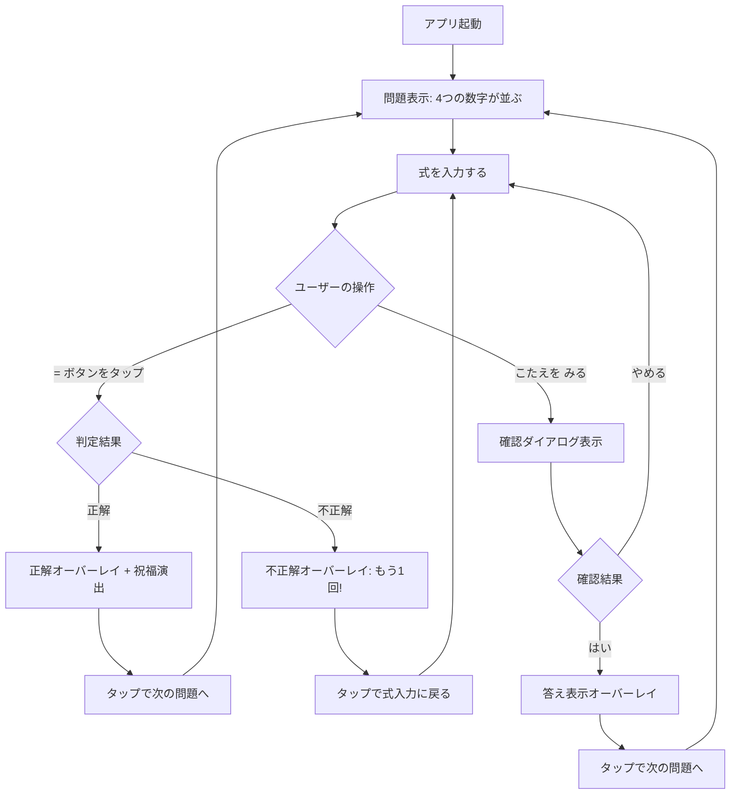
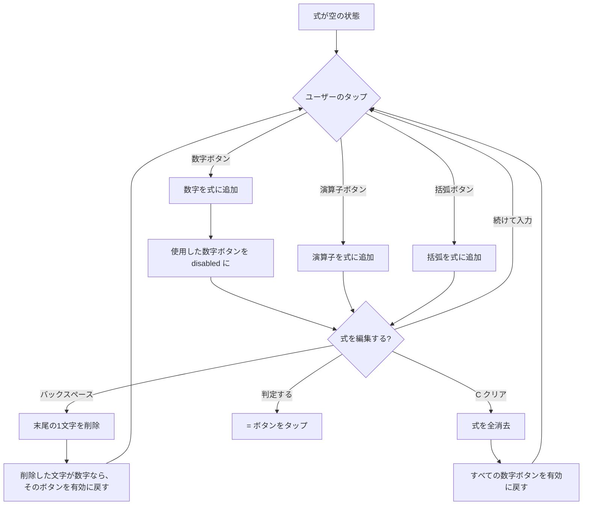
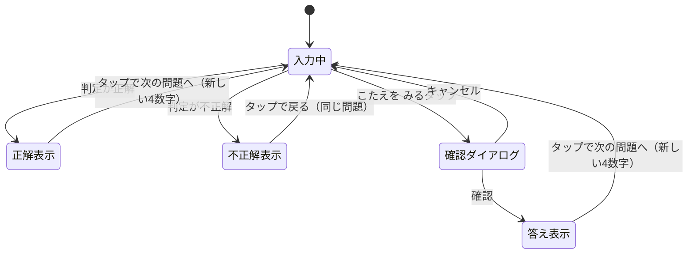
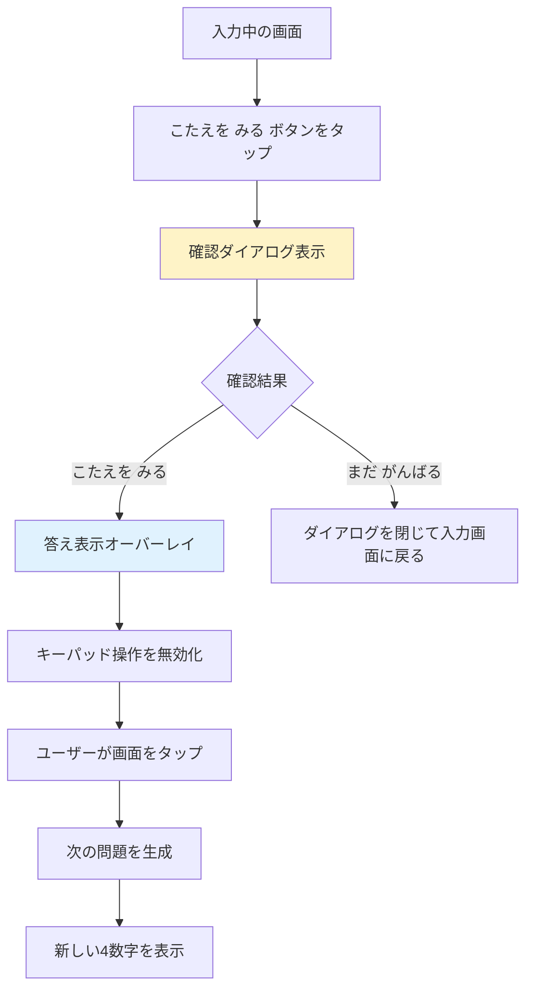

# UX Design: Make 10 UI リデザイン

## 変更履歴

| 版 | 日付 | 内容 |
|----|------|------|
| v1 | - | 初版: ポップ & 子ども向けテーマの UI デザイン |
| v2 | 2026-02-28 | ギブアップ機能、アンビエントアニメーション、入力演出、祝福バリエーション、アイドルアニメーション追加 |

---

## 1. デザイン原則

### 1.1 明るく、楽しく、安心

子ども（7〜9歳）が「やりたい!」と思えるビジュアル。明るいライトモードベースに、ポップなカラーと柔らかい角丸で親しみやすさを作る。保護者が見ても「安心して遊ばせられる」クリーンなデザイン。

### 1.2 一目でわかる

数字、演算子、コントロールの 3 種類のボタンが配色と形状で即座に区別できる。使用済みの数字は色だけでなく視覚的な変化（取り消し線、縮小）で明確に伝える。

### 1.3 正解が嬉しい

正解時のフィードバックが画面全体で祝福する。紙吹雪、スコアのバウンスアニメーション、励ましメッセージで達成感を最大化する。不正解時は否定せず、前向きに再挑戦を促す。

### 1.4 分からなくても大丈夫（v2 追加）

行き詰まったとき、「こたえを みる」で答えを確認し、学びを得てから次に進める。ギブアップは恥ずかしいことではなく、「勉強になった」と感じられるフレンドリーなトーンを徹底する。

### 1.5 画面が生きている（v2 追加）

操作していない時間帯も、背景のアンビエントアニメーションやアイドル時のボタン揺れで画面が緩やかに動き続ける。「見ているだけで楽しい」感覚を作るが、操作を邪魔しない控えめさを保つ。

### 1.6 ロジックに触れない

UI レイヤーの刷新のみ。`useMake10` フック、`generatePuzzle`、`validator`、`parser` は一切変更しない。コンポーネントの props インターフェースも現行を維持する。

ただし v2 では `useMake10` にギブアップ関連の状態管理（`giveUp` アクション、答えの保持）を追加する。既存のゲームロジック（正解判定、スコア計算、式パース）には触れない。

---

## 2. ユーザーフロー

### 2.1 メインゲームフロー（v2 更新）



### 2.2 式入力の詳細フロー



### 2.3 フィードバック状態の遷移（v2 更新）



### 2.4 ギブアップフロー（v2 新規）



ポイント:
- スコアは加算しない
- 式が空の状態でもギブアップ可能（考える前にスキップしたいケースに対応）
- 確認ダイアログは誤タップ防止のため必須（子どもの操作を考慮）

---

## 3. 画面定義

アプリは単一画面構成。ルーティングやページ遷移は存在しない。画面内の領域を 5 つのゾーン + 背景レイヤーに分割する。

### 3.1 画面レイアウト（縦向き 375px 幅基準、v2 更新）

```
+------------------------------------------+
|  [Ambient Background Layer]              |  ← v2: position: fixed, z-index: 0
|  (浮遊する丸・星・図形)                     |
+==========================================+
|  [Header Zone]                           |  z-index: 10
|  Make 10 ロゴ          スコアバッジ       |
+------------------------------------------+
|                                          |
|  [Display Zone]                          |
|  ┌────────────────────────────────────┐  |
|  │           3 + 5 × _               │  |  ← v2: 文字バウンスアニメーション
|  └────────────────────────────────────┘  |
|                                          |
+------------------------------------------+
|                                          |
|  [Number Pad Zone]                       |
|  ┌──────┐ ┌──────┐ ┌──────┐ ┌──────┐   |  ← v2: アイドル時に揺れ
|  │  3   │ │  5   │ │  2   │ │  8   │   |
|  │      │ │      │ │(used)│ │      │   |
|  └──────┘ └──────┘ └──────┘ └──────┘   |
|                                          |
+------------------------------------------+
|  [Operator Pad Zone]                     |
|  ┌────┐ ┌────┐ ┌────┐ ┌────┐ ┌──┐ ┌──┐ |
|  │ +  │ │ -  │ │ x  │ │ /  │ │( │ │) │ |
|  └────┘ └────┘ └────┘ └────┘ └──┘ └──┘ |
|                                          |
+------------------------------------------+
|  [Control Pad Zone]                      |  ← v2: 4列に変更
|  ┌────────┐ ┌──────┐ ┌──────┐ ┌──────┐ |
|  │こたえを│ │  ⌫  │ │  C   │ │  =   │ |
|  │ みる  │ │      │ │      │ │      │ |
|  └────────┘ └──────┘ └──────┘ └──────┘ |
+------------------------------------------+
```

### 3.2 Ambient Background Layer（v2 新規）

用途: 画面全体の背景にゆっくり浮遊する装飾要素を配置し、「生きている」感覚を演出する

要素:
- 6〜8 個の装飾要素（丸、星、三角形など）
- 各要素は異なるサイズ（20px〜60px）、不透明度（0.05〜0.15）、色（パステルカラー）
- CSS アニメーションで緩やかに上下左右に浮遊

配置ルール:
- `position: fixed` / `inset: 0` / `z-index: 0` / `pointer-events: none`
- 前景コンテンツ（z-index: 10+）の背後に表示
- `overflow: hidden` で画面外にはみ出す要素を隠す

アニメーション:
- 各要素に異なる duration（15s〜25s）と delay を設定
- `transform: translate()` のみを使用（レイアウト再計算を発生させない）
- `will-change: transform` を付与
- 軌道はゆるやかな楕円 or サインカーブ（keyframes で表現）

パフォーマンス:
- 純粋な CSS アニメーション（JS 不要）
- `will-change: transform` で GPU レイヤーに昇格
- 要素数を 8 個以下に制限

視覚的な仕様:
| 要素 | サイズ | 色 | 不透明度 | 形状 |
|------|--------|-----|---------|------|
| 要素 1 | 40px | rose-300 | 0.08 | 丸 |
| 要素 2 | 24px | sky-300 | 0.10 | 星 |
| 要素 3 | 52px | amber-200 | 0.06 | 丸 |
| 要素 4 | 32px | violet-300 | 0.10 | 三角形 |
| 要素 5 | 20px | emerald-300 | 0.12 | 丸 |
| 要素 6 | 44px | pink-200 | 0.07 | 星 |
| 要素 7 | 28px | indigo-200 | 0.09 | 丸 |
| 要素 8 | 36px | teal-200 | 0.08 | 三角形 |

### 3.3 Header Zone

用途: アプリタイトルとスコアの常時表示

要素:
- アプリタイトル「Make 10」（左寄せ、大きめ、Nunito Bold）
- スコアバッジ（右寄せ、ピル型の角丸カプセル）

状態:
- 通常: スコアを静的に表示
- スコア更新時: 数字がバウンスアニメーション（scale 1.0 → 1.3 → 1.0、300ms）
- v2 アイドル時: 星マークが軽くキラキラと瞬く（Should Have: S7）

レイアウト: `flex` / `justify-between` / `items-center` / 水平パディング 20px / 垂直パディング 16px

### 3.4 Display Zone（v2 更新）

用途: 入力中の式を表示するエリア

要素:
- 式表示エリア（角丸カード、右寄せテキスト）
- プレースホルダー（式が空のとき）

状態:
| 状態 | 表示内容 |
|------|---------|
| 空 | プレースホルダー「しきを つくろう!」（薄いグレーテキスト） |
| 空 + アイドル | プレースホルダーが緩やかにフェードイン・アウト（v2: S7） |
| 入力中 | 入力された式（例: `3 + 5 ×`）。新しい文字は軽くバウンスして表示（v2: S5） |
| 全数字使用済み | = ボタンがパルスアニメーションして判定を促す（v2: S5） |
| フィードバック表示中 | 最後に入力した式をそのまま表示（編集不可） |
| 答え表示中（v2） | ギブアップ時の正解式を表示（編集不可） |

v2 ライブ入力アニメーション（S5）:
- 式の各文字をスパン要素で個別にラップする
- 新しく追加された文字に `animate-char-bounce` を適用（scale 1.0 → 1.15 → 1.0, 200ms）
- バックスペースで削除した場合、最後尾の文字がフェードアウト（100ms）
- 全数字が使われた状態（4 つの数字すべてが式に含まれる）で、= ボタンに `animate-pulse-glow` を適用

レイアウト: 水平パディング 20px / カード内パディング 20px 上下 24px / min-height 4rem / 角丸 16px

### 3.5 Number Pad Zone（v2 更新）

用途: 出題された 4 つの数字を表示し、タップで式に追加する

要素:
- 4 つの数字ボタン（4 列グリッド）

状態:
| 状態 | 外観 |
|------|------|
| 利用可能 | 鮮やかなポップカラー、影あり、タップ可能 |
| 使用済み | 透明度 30%、影なし、テキストに取り消し線、disabled |
| タップ中 | scale(0.92) + 色が少し明るくなる |
| 新問題登場時 | ポップインアニメーション（scale 0 → 1.05 → 1.0、各ボタンに 50ms ずつディレイ） |
| アイドル時（v2: S7） | 未使用のボタンが軽くバウンス（2〜3px の上下）。各ボタンに 0.5s ずつ遅延で波打つように |

各ボタンの配色（固定の 4 色ローテーション）:
- ボタン 1: コーラルピンク（bg-rose-400）
- ボタン 2: スカイブルー（bg-sky-400）
- ボタン 3: エメラルドグリーン（bg-emerald-400）
- ボタン 4: アンバーイエロー（bg-amber-400）

レイアウト: 4 列グリッド / gap 12px / 水平パディング 20px / ボタン高さ 72px / 角丸 16px

### 3.6 Operator Pad Zone

用途: 四則演算子と括弧の入力

要素:
- 演算子ボタン 4 つ（+, -, x, /）
- 括弧ボタン 2 つ（(, )）

状態:
| 状態 | 外観 |
|------|------|
| 通常 | バイオレット系のアクセントカラー、数字ボタンとは明確に異なる色相 |
| タップ中 | scale(0.92) + リップルエフェクト |
| フィードバック表示中 | disabled（操作不可） |

演算子と括弧の視覚的区別:
- 演算子（+, -, x, /）: パープル / バイオレット系（bg-violet-400）
- 括弧（(, )）: グレー系（bg-slate-300）

レイアウト: 6 列グリッド / gap 8px / 水平パディング 20px / ボタン高さ 56px / 角丸 16px

### 3.7 Control Pad Zone（v2 更新）

用途: ギブアップ、バックスペース、クリア、判定の 4 操作

v2 では「こたえを みる」ボタンを追加し、3 列から 4 列グリッドに変更する。

要素:
- ギブアップボタン（こたえを みる）-- v2 新規
- バックスペースボタン（⌫）
- クリアボタン（C）
- 判定ボタン（=）

レイアウト変更（v1 → v2）:
```
v1: 3列グリッド
┌──────────┐ ┌────────┐ ┌──────────┐
│    ⌫     │ │   C    │ │    =     │
└──────────┘ └────────┘ └──────────┘

v2: 4列グリッド
┌────────┐ ┌──────┐ ┌──────┐ ┌──────┐
│こたえを│ │  ⌫  │ │  C   │ │  =   │
│ みる  │ │      │ │      │ │      │
└────────┘ └──────┘ └──────┘ └──────┘
```

状態:
| 状態 | 外観 |
|------|------|
| 通常 | 各ボタン固有の色 |
| タップ中 | scale(0.92) |
| フィードバック表示中 | disabled（透明度 40%） |
| 答え表示中（v2） | 全ボタン disabled（透明度 40%） |

各ボタンの配色:
- ギブアップ（こたえを みる）: bg-violet-100, テキスト violet-500, font-bold, text-sm。目立ちすぎず、しかし見つけやすい配色。orange/pink 系の = ボタンと明確に区別する
- バックスペース: ニュートラルグレー（bg-slate-200、テキスト slate-600）
- クリア: ソフトレッド（bg-red-100、テキスト red-500）
- 判定（=）: 画面内で最も目立つ CTA。グラデーション（from-orange-400 to-pink-500）、白テキスト、大きめのカラーシャドウ

ギブアップボタンのデザイン意図:
- 子どもが「どうしても分からない」ときに自然と目に入る位置（コントロールパッドの左端）
- しかし = ボタンほど目立たせない（最初に押すべきは = であって、ギブアップではない）
- violet 系の淡い色にすることで、「ネガティブ」でも「メイン操作」でもない中立的な印象を与える
- `aria-label="こたえを みる"` を付与

レイアウト: 4 列グリッド / gap 12px / 水平パディング 20px / ボタン高さ 72px / 角丸 16px

### 3.8 Give Up Confirmation Dialog（v2 新規）

用途: ギブアップの誤タップを防止し、子どもに確認を促す

表示条件: 「こたえを みる」ボタンをタップしたとき

```
┌─────────────────────────────────────┐
│                                     │
│              🤔                     │
│                                     │
│    こたえを みても いいかな?         │
│                                     │
│  ┌──────────────┐ ┌──────────────┐  │
│  │ まだ がんばる │ │ こたえを みる │  │
│  └──────────────┘ └──────────────┘  │
│                                     │
└─────────────────────────────────────┘
```

要素:
- 半透明背景オーバーレイ（bg-black/40, backdrop-blur-sm）
- ダイアログカード（白背景、角丸 24px、shadow-2xl）
- 絵文字アイコン: 🤔（48px）
- メッセージ:「こたえを みても いいかな?」（text-xl, font-bold, slate-700）
- 2 つのアクションボタン:
  - 「まだ がんばる」: bg-emerald-400, text-white, rounded-xl, font-bold。左側配置
  - 「こたえを みる」: bg-violet-100, text-violet-600, rounded-xl, font-bold。右側配置

デザイン判断:
- 「まだ がんばる」をエメラルドグリーン（ポジティブ色）にして、続行が推奨されるアクションであることを視覚的に伝える
- 「こたえを みる」はバイオレットの淡い色にして、控えめなトーン。ただしタップ領域は十分に確保（48px 高）
- 2 つのボタンは横並びで、子どもでも迷わず選択できるサイズ感
- ダイアログ外のタップではダイアログを閉じない（誤操作防止）

アニメーション:
- 背景: フェードイン（200ms, ease-out）
- カード: scale(0.9) + opacity(0) → scale(1.0) + opacity(1)（250ms, ease-out）

アクセシビリティ:
- `role="dialog"` / `aria-modal="true"` / `aria-labelledby` でダイアログの目的を示す
- フォーカスをダイアログ内にトラップする（Tab キー対応）
- ESC キーで「まだ がんばる」と同じ動作

### 3.9 Answer Reveal Overlay（v2 新規）

用途: ギブアップ後に正解の式を表示し、学びの機会を提供する

表示条件: 確認ダイアログで「こたえを みる」を選択したとき

```
┌─────────────────────────────────────┐
│                                     │
│              📖                     │
│                                     │
│  こうやって とくんだね!              │
│                                     │
│  ┌─────────────────────────────┐    │
│  │     (3+5)×2-8 = 10         │    │  ← v2: 正解式
│  └─────────────────────────────┘    │
│                                     │
│   タップで つぎのもんだいへ          │
│                                     │
└─────────────────────────────────────┘
```

要素:
- 半透明背景オーバーレイ（bg-black/50, backdrop-blur-sm）-- 正解/不正解と同じ
- フィードバックカード:
  - 背景: bg-gradient-to-br from-sky-400 to-indigo-500（青系。正解の緑、不正解のオレンジとは異なる色相で「学び」の雰囲気を表現）
  - 絵文字アイコン: 📖（72px）
  - メッセージ:「こうやって とくんだね!」（text-2xl, font-bold, white）
  - 答えの式: 白背景 + rounded-xl のカードに、式テキストを大きく表示（text-3xl, font-bold, slate-800）
  - サブテキスト:「タップで つぎのもんだいへ」（text-sm, white/80）
  - 角丸: 24px
  - シャドウ: shadow-2xl shadow-indigo-500/40

答えの式の表示仕様:
- 全角演算子（×, ÷）を使用（ユーザーが入力する式と同じ表記）
- 式の末尾に「= 10」を添えて、結果が 10 になることを明示する
- 式は事前計算されており、タップ時に遅延なく表示する

状態遷移:
- 答え表示中はすべてのキーパッドが disabled
- 画面タップで次の問題に進む（正解時と同じ遷移）
- スコアは変動しない

アニメーション:
- 背景: フェードイン（200ms, ease-out）
- カード: ポップイン（scale 0.8 → 1.05 → 1.0, 300ms）-- 正解/不正解オーバーレイと同じ
- Could Have (C5): 答えの式を一文字ずつタイプライター風に表示

アクセシビリティ:
- 答えの式を含むカード全体に `aria-live="polite"` を付与
- 式テキストには `role="text"` を付与

### 3.10 Feedback Overlay（v1 から継続、v2 更新）

用途: 正解 / 不正解のフィードバックを全画面オーバーレイで表示する

要素:
- 半透明背景（タップで閉じる）
- フィードバックカード（アイコン + メッセージ + サブテキスト）
- 正解時: 祝福演出（v2 でバリエーション追加）

状態:
| 状態 | 内容 |
|------|------|
| 正解 | アイコン: パーティーポッパー絵文字、メッセージ: ランダム正解メッセージ（v2）、サブ:「タップで つぎのもんだいへ」、背景カード: エメラルドグラデーション、祝福演出再生（v2 でバリエーション化） |
| 不正解 | アイコン: がんばれ絵文字、メッセージ:「おしい! もういっかい!」、サブ:「タップで もどる」、背景カード: オレンジ〜イエローグラデーション（赤を避け、否定感を減らす） |

v2 正解メッセージのバリエーション（S6）:
ランダムで以下のメッセージの中から 1 つ選択して表示する:
- 「すごい! せいかい!」
- 「やったね! てんさい!」
- 「かんぺき!」
- 「おみごと!」
- 「ばっちり!」

v2 祝福演出のバリエーション（S6）:
- 基本: 紙吹雪エフェクト（v1 と同じ）
- バリエーション 1: スターバースト（星が中央から放射状に飛ぶ）
- バリエーション 2: キラキラエフェクト（画面全体に光の粒子がキラキラと広がる）
- 連続正解時（ストリーク）: 演出が段階的に豪華に（C1 との連携）

演出の選択ロジック:
- 通常: 紙吹雪、スターバースト、キラキラからランダム選択
- 3 連続正解以上: 複数の演出を同時再生

表示アニメーション: 背景フェードイン（200ms）+ カードがポップイン（scale 0.8 → 1.05 → 1.0、300ms）
非表示: フェードアウト（150ms）

---

## 4. コンポーネントカタログ

既存のコンポーネント構成を維持し、v2 で新規コンポーネントを最小限追加する。

### 4.1 既存コンポーネント（v2 でスタイル / Props 変更あり）

| コンポーネント | ファイル | Props 変更（v2） | 変更の概要 |
|---------------|---------|-----------------|-----------|
| `Header` | `src/components/Header.tsx` | なし | アイドル時の星キラキラ追加（S7） |
| `Display` | `src/components/Display.tsx` | `answer?: string` を追加 | 文字バウンスアニメーション（S5）、答え表示対応、プレースホルダーのフェードアニメーション（S7） |
| `NumberPad` | `src/components/NumberPad.tsx` | なし | アイドルバウンスアニメーション追加（S7） |
| `OperatorPad` | `src/components/OperatorPad.tsx` | なし | 変更なし |
| `ControlPad` | `src/components/ControlPad.tsx` | `onGiveUp: () => void` を追加 | 4 列グリッドに変更、ギブアップボタン追加 |
| `FeedbackOverlay` | `src/components/FeedbackOverlay.tsx` | `feedback` 型を拡張 | 答え表示オーバーレイ、祝福演出バリエーション（S6） |

### 4.2 新規コンポーネント（v2）

| コンポーネント | ファイル | Props | 説明 |
|---------------|---------|-------|------|
| `AmbientBackground` | `src/components/AmbientBackground.tsx` | なし | 背景の浮遊装飾要素。純粋な CSS アニメーション。App.tsx の最初の子要素として配置 |
| `GiveUpConfirmDialog` | `src/components/GiveUpConfirmDialog.tsx` | `{ open: boolean, onConfirm: () => void, onCancel: () => void }` | ギブアップ確認ダイアログ。モーダルオーバーレイ |

### 4.3 新規 CSS / ユーティリティ（v2）

| 要素 | 種類 | 説明 |
|------|------|------|
| アンビエント浮遊 | CSS キーフレーム | `@keyframes ambient-float` — 背景装飾の緩やかな浮遊 |
| 文字バウンス | CSS キーフレーム | `@keyframes char-bounce` — 式入力時の個別文字バウンス |
| パルスグロー | CSS キーフレーム | `@keyframes pulse-glow` — = ボタンの判定催促パルス |
| アイドルバウンス | CSS キーフレーム | `@keyframes idle-bounce` — アイドル時のボタン揺れ |
| プレースホルダーフェード | CSS キーフレーム | `@keyframes placeholder-fade` — プレースホルダーの緩やかなフェード |
| スターバースト | CSS キーフレーム | `@keyframes starburst` — 星が放射状に飛ぶ祝福演出 |
| キラキラ | CSS キーフレーム | `@keyframes sparkle` — キラキラエフェクト |
| 星キラキラ | CSS キーフレーム | `@keyframes star-twinkle` — ヘッダー星マークの瞬き |

### 4.4 各コンポーネントの詳細設計

#### Header（v2 更新）

```
┌─────────────────────────────────────────┐
│  Make 10              ⭐ 12             │
│  (Nunito Bold 24px)   (ピル型バッジ)      │
└─────────────────────────────────────────┘
```

- タイトル: Nunito Bold, 24px, color: slate-800
- スコアバッジ: ピル型（rounded-full）、bg-gradient-to-r from-amber-300 to-orange-400、テキスト: orange-900、font-bold
- スコア更新時: バッジ全体に `score-bounce` アニメーション適用
- v2 アイドル時: 星マーク（⭐）に `animate-star-twinkle` を適用（opacity 0.6 → 1.0 → 0.6 を 3s サイクルで繰り返す）

#### Display（v2 更新）

```
┌─────────────────────────────────────────┐
│                                         │
│                    3 + 5 × _            │
│                                         │
└─────────────────────────────────────────┘
```

- コンテナ: bg-white/90, border-2 border-violet-200, rounded-2xl, shadow-sm, backdrop-blur-sm
- テキスト: Nunito, 32px, font-semibold, color: slate-800, text-right
- プレースホルダー: 「しきを つくろう!」, color: slate-300, text-center
- 最小高さ: 4rem（64px）

v2 追加:
- 式テキストのレンダリング: 各文字を `<span>` でラップし、新たに追加された文字に `animate-char-bounce` を付与
- プレースホルダーにアイドル時 `animate-placeholder-fade` を付与（S7）
- 答え表示時: `answer` prop を受け取り、「{answer} = 10」形式で表示。テキスト色は slate-800、背景は変更なし

#### NumberPad ボタン

```
┌─────────┐
│         │
│    3    │   72px高 x 均等幅
│         │   角丸16px
└─────────┘
```

利用可能状態:
- 各ボタンに固有の背景色（4 色ローテーション）
- テキスト: 白, Nunito Bold, 28px
- シャドウ: ボタン色に合わせたカラーシャドウ（shadow-{color}-300/50）
- active: scale(0.92), transition 100ms

使用済み状態:
- bg-slate-100
- テキスト: slate-300, line-through
- シャドウ: なし
- disabled 属性付与

v2 アイドル状態（S7）:
- 未使用のボタンが `animate-idle-bounce` を適用
- animation-delay: ボタンごとに 0s, 0.5s, 1.0s, 1.5s でずらし、波打つ効果を作る
- アイドル判定: 最後の操作から 5 秒間入力がない場合に開始。入力があれば即停止

#### OperatorPad ボタン

演算子ボタン:
- bg-violet-400, テキスト: 白, 20px, font-bold
- active: scale(0.92), bg-violet-500
- 高さ: 56px, 角丸: 16px

括弧ボタン:
- bg-slate-200, テキスト: slate-500, 20px
- active: scale(0.92), bg-slate-300
- 高さ: 56px, 角丸: 16px

#### ControlPad ボタン（v2 更新）

ギブアップ（こたえを みる）-- v2 新規:
- bg-violet-100, テキスト: violet-500, font-bold, text-sm
- shadow-sm
- 高さ: 72px
- 2 行テキスト（「こたえを」「みる」を text-center で縦積み）
- aria-label="こたえを みる"
- disabled 時: opacity 40%

バックスペース:
- bg-slate-200, テキスト: slate-600
- 高さ: 72px

クリア:
- bg-red-100, テキスト: red-500
- 高さ: 72px

判定（=）:
- bg-gradient-to-r from-orange-400 to-pink-500
- テキスト: 白, 24px, font-extrabold
- shadow-lg shadow-orange-400/40
- 高さ: 72px
- 画面内で最も視覚的に目立つボタン
- v2: 全数字使用時に `animate-pulse-glow` を付与（S5）

#### FeedbackOverlay（v2 更新）

正解カード:
```
┌─────────────────────┐
│                     │
│        🎉          │
│                     │
│   やったね! てんさい! │  ← v2: ランダムメッセージ
│                     │
│  タップで つぎの      │
│  もんだいへ          │
│                     │
└─────────────────────┘
```
- 背景: bg-gradient-to-br from-emerald-400 to-teal-500
- テキスト: 白
- アイコン: 72px
- メッセージ: 36px, font-bold。v2 でランダム選択
- サブテキスト: 14px, white/80
- 角丸: 24px
- シャドウ: shadow-2xl shadow-emerald-500/40

不正解カード:
- 背景: bg-gradient-to-br from-amber-400 to-orange-500（赤ではなくオレンジ〜イエロー系にして否定感を軽減）
- アイコン: 💪 または 🌟（泣き顔を避け、前向きな絵文字）
- メッセージ: 「おしい! もういっかい!」
- サブテキスト: 「タップで もどる」

答え表示カード（v2 新規）:
```
┌─────────────────────┐
│                     │
│        📖          │
│                     │
│ こうやって とくんだね! │
│                     │
│ ┌─────────────────┐ │
│ │ (3+5)×2-8 = 10  │ │
│ └─────────────────┘ │
│                     │
│ タップで つぎの       │
│ もんだいへ           │
│                     │
└─────────────────────┘
```
- 背景: bg-gradient-to-br from-sky-400 to-indigo-500
- アイコン: 📖 (72px)
- メッセージ:「こうやって とくんだね!」(text-2xl, font-bold, white)
- 答えカード: bg-white/90, rounded-xl, px-6 py-3
- 答えテキスト: text-3xl, font-bold, slate-800
- サブテキスト: 「タップで つぎのもんだいへ」(text-sm, white/80)
- 角丸: 24px
- シャドウ: shadow-2xl shadow-indigo-500/40

#### AmbientBackground（v2 新規）

```tsx
// 概念的な構造
<div className="ambient-bg">
  <div className="ambient-shape shape-circle" style="...">   {/* 丸 */}
  <div className="ambient-shape shape-star" style="...">     {/* 星 */}
  <div className="ambient-shape shape-triangle" style="..."> {/* 三角 */}
  {/* ... 6〜8 個 */}
</div>
```

- コンテナ: `position: fixed` / `inset: 0` / `z-index: 0` / `pointer-events: none` / `overflow: hidden`
- 各シェイプは `position: absolute` で配置
- 形状の実装:
  - 丸: `border-radius: 50%` + 背景色
  - 星: CSS clip-path (`polygon(50% 0%, 61% 35%, 98% 35%, 68% 57%, 79% 91%, 50% 70%, 21% 91%, 32% 57%, 2% 35%, 39% 35%)`)
  - 三角形: CSS clip-path (`polygon(50% 0%, 0% 100%, 100% 100%)`)
- アニメーション: 各要素に `animation: ambient-float {duration}s ease-in-out infinite` を適用

#### GiveUpConfirmDialog（v2 新規）

```tsx
// 概念的な構造
<div className="overlay" role="dialog" aria-modal="true">
  <div className="dialog-card">
    <span className="emoji">🤔</span>
    <p className="message">こたえを みても いいかな?</p>
    <div className="actions">
      <button className="btn-continue">まだ がんばる</button>
      <button className="btn-reveal">こたえを みる</button>
    </div>
  </div>
</div>
```

Props:
- `open: boolean` -- ダイアログの表示/非表示
- `onConfirm: () => void` -- 「こたえを みる」タップ時
- `onCancel: () => void` -- 「まだ がんばる」タップ時

スタイル:
- オーバーレイ: fixed inset-0, bg-black/40, backdrop-blur-sm, z-50
- カード: bg-white, rounded-3xl, shadow-2xl, px-8 py-10, max-w-[320px], mx-auto
- 絵文字: text-5xl, text-center
- メッセージ: text-xl, font-bold, text-slate-700, text-center
- 「まだ がんばる」ボタン: bg-emerald-400, text-white, rounded-xl, font-bold, h-12, flex-1
- 「こたえを みる」ボタン: bg-violet-100, text-violet-600, rounded-xl, font-bold, h-12, flex-1
- ボタンエリア: flex, gap-3

---

## 5. ナビゲーション構造

単一画面アプリのため、画面間のナビゲーションは存在しない。ユーザーの操作はすべて同一画面内で完結する。

操作の流れ（v2 更新）:
1. 数字ボタンタップ → 式に数字追加（+ 文字バウンスアニメーション）
2. 演算子ボタンタップ → 式に演算子追加（+ 文字バウンスアニメーション）
3. 括弧ボタンタップ → 式に括弧追加
4. ⌫ タップ → 式末尾を 1 文字削除
5. C タップ → 式を全消去
6. = タップ → 判定、オーバーレイ表示
7. オーバーレイタップ → 正解なら次の問題、不正解なら式入力に戻る
8. こたえを みるタップ → 確認ダイアログ表示（v2 新規）
9. 確認ダイアログ → 「まだ がんばる」で閉じる、「こたえを みる」で答え表示（v2 新規）
10. 答え表示タップ → 次の問題に進む（v2 新規）

オーバーレイ / ダイアログ表示中はすべてのボタンが disabled になる（現行の `feedback !== null` チェックに加え、`showGiveUpConfirm` / `showAnswer` の状態も考慮）。

---

## 6. レスポンシブ戦略

### 6.1 対象デバイス

PRD で定義された対象範囲:
- 主な対象: 320px〜428px（iPhone SE〜iPhone 15 Pro Max）
- 縦向き前提（landscape は考慮外）

### 6.2 ブレークポイント

モバイルファーストのため、ブレークポイントは最小限にする。

| 幅 | 対応 |
|----|------|
| 320px〜374px | 小型端末。パディングを 16px に縮小、ボタン高さ 64px に縮小、フォントサイズ微調整、ControlPad のギブアップボタンのテキストを 1 行に縮小（「こたえ」のみ） |
| 375px〜428px | 標準。本デザインドキュメントの基準サイズ |
| 429px〜 | タブレット以上。max-width: 428px でコンテンツを中央配置、左右に余白 |

### 6.3 レイアウトの適応

全幅レイアウト（320〜428px）:
- パッドの水平パディング: 16px（320px）〜20px（375px+）
- ボタン間のギャップ: 8px（320px）〜12px（375px+）
- ボタン高さ: 64px（320px）〜72px（375px+）
- Display のフォントサイズ: 28px（320px）〜32px（375px+）

コンテンツ幅制限（429px+）:
```css
max-width: 428px;
margin: 0 auto;
```

v2 追加考慮:
- ControlPad が 4 列になったことで、320px 幅ではボタン幅がやや狭くなる。ギブアップボタンのテキストサイズを text-xs に縮小し、他 3 ボタンの幅とのバランスを取る
- 確認ダイアログは max-width: 320px で中央配置。320px 端末でも画面幅に収まる
- アンビエント背景の装飾要素は画面サイズに依存しない（fixed 配置のため）

### 6.4 高さの適応

dvh（dynamic viewport height）を使い、アドレスバーの出し入れに対応する（現行の `100dvh` を維持）。

5 つのゾーンの配分:
- Header: 固定高（約 56px）
- Display: 柔軟（min-height 4rem、flex でスペースを吸収）
- Number Pad: ボタン高さ固定 + gap
- Operator Pad: ボタン高さ固定 + gap
- Control Pad: ボタン高さ固定 + gap + 下部パディング

`flex-1` を Display ゾーンの親に適用し、キーパッド群は `flex-col` の末尾に配置して画面下部に固定する（現行構造を維持）。

---

## 7. アクセシビリティ

### 7.1 タッチターゲット

- すべてのインタラクティブ要素の最小タッチ領域: 48x48px
- 数字ボタン・コントロールボタン: 72px 高（推奨以上）
- 演算子ボタン: 56px 高（最小 48px を満たす）
- ボタン間のギャップ: 8px 以上（誤タップ防止）
- v2 ギブアップボタン: 72px 高（コントロールパッドの他ボタンと同じ高さ）
- v2 確認ダイアログのボタン: 48px 高（最小タッチ領域を確保）

### 7.2 コントラスト比

WCAG AA 準拠（4.5:1 以上）を全テキストで確保する。

| 要素 | 前景色 | 背景色 | 想定コントラスト比 |
|------|--------|--------|-------------------|
| タイトル | slate-800 (#1e293b) | 明るいグラデーション背景 | 7:1 以上 |
| スコアバッジ | orange-900 (#7c2d12) | amber-300 (#fcd34d) | 4.5:1 以上 |
| 式テキスト | slate-800 (#1e293b) | white (#ffffff) | 12:1 以上 |
| プレースホルダー | slate-400 (#94a3b8) | white (#ffffff) | 3:1 以上（装飾テキストのため許容） |
| 数字ボタン文字 | white (#ffffff) | rose-400 / sky-400 / emerald-400 / amber-400 | 各色で 4.5:1 以上を確認 |
| 演算子ボタン文字 | white (#ffffff) | violet-400 (#a78bfa) | 検証必要（violet-500 にフォールバック） |
| = ボタン文字 | white (#ffffff) | orange-400〜pink-500 | 4.5:1 以上 |
| v2: ギブアップボタン文字 | violet-500 (#8b5cf6) | violet-100 (#ede9fe) | 4.5:1 以上（要検証） |
| v2: 確認ダイアログメッセージ | slate-700 (#334155) | white (#ffffff) | 10:1 以上 |
| v2: 答え表示テキスト | white (#ffffff) | sky-400〜indigo-500 | 4.5:1 以上 |
| v2: 答えカード内テキスト | slate-800 (#1e293b) | white/90 | 12:1 以上 |

実装時の検証ポイント: 数字ボタンの白文字と各ポップカラーの組み合わせが 4.5:1 を満たさない場合、ボタン色を 500 番台（amber-500 など）に引き上げる。

### 7.3 状態の非色覚的伝達

使用済み数字ボタンは色の変化だけに依存しない:
- 透明度の変化（opacity 30%）
- テキストの取り消し線（line-through）
- disabled 属性の付与（スクリーンリーダー対応）
- ボタンのスケール縮小（scale 0.9）

### 7.4 アニメーションへの配慮（v2 拡張）

`prefers-reduced-motion: reduce` メディアクエリに対応する:
- 紙吹雪エフェクトを無効化
- スターバースト / キラキラエフェクトを無効化（v2）
- アンビエント背景の浮遊を停止（v2）
- ポップインアニメーションを即時表示に変更
- バウンスアニメーションを無効化
- 文字バウンスを無効化（v2）
- アイドルアニメーションを無効化（v2）
- パルスグローを無効化（v2）
- トランジションの duration を 0 に設定

```css
@media (prefers-reduced-motion: reduce) {
  *, *::before, *::after {
    animation-duration: 0.01ms !important;
    animation-delay: 0ms !important;
    transition-duration: 0.01ms !important;
  }
}
```

### 7.5 セマンティクス（v2 拡張）

- ボタンにはすべて `type="button"` を付与（現行維持）
- disabled ボタンには `disabled` 属性を付与（現行維持）
- フィードバックオーバーレイの紙吹雪要素に `aria-hidden="true"` を付与（現行維持）
- Display 領域に `aria-live="polite"` を追加し、式の変更をスクリーンリーダーに通知する
- v2: ギブアップボタンに `aria-label="こたえを みる"` を付与
- v2: 確認ダイアログに `role="dialog"` / `aria-modal="true"` / `aria-labelledby` を付与
- v2: 答え表示の式に `aria-live="polite"` を付与
- v2: アンビエント背景コンテナに `aria-hidden="true"` を付与
- v2: スターバースト / キラキラ要素に `aria-hidden="true"` を付与

---

## 8. ビジュアルスタイルガイド

### 8.1 カラーパレット

#### 背景

ライトモードベースの暖色系グラデーション:
```
メイン背景: linear-gradient(135deg, #fef3c7 0%, #fce7f3 50%, #e0e7ff 100%)
          （amber-100 → pink-100 → indigo-100）
```

パステルの暖かさと柔らかさを保ちつつ、白に近い明度で読みやすさを確保する。

#### ボタンカラー

数字ボタン（4 色ローテーション）:
| 位置 | 色名 | Tailwind | HEX | 用途 |
|------|------|----------|-----|------|
| 1番目 | コーラルピンク | rose-400 | #fb7185 | 数字ボタン 1 |
| 2番目 | スカイブルー | sky-400 | #38bdf8 | 数字ボタン 2 |
| 3番目 | エメラルド | emerald-400 | #34d399 | 数字ボタン 3 |
| 4番目 | アンバー | amber-400 | #fbbf24 | 数字ボタン 4 |

演算子ボタン:
| 要素 | Tailwind | HEX |
|------|----------|-----|
| 演算子（+, -, x, /） | violet-400 | #a78bfa |
| 括弧（(, )） | slate-200 | #e2e8f0 |

コントロールボタン:
| 要素 | Tailwind | HEX |
|------|----------|-----|
| ギブアップ（v2） | violet-100 / テキスト violet-500 | #ede9fe / #8b5cf6 |
| バックスペース | slate-200 | #e2e8f0 |
| クリア | red-100 / テキスト red-500 | #fee2e2 / #ef4444 |
| 判定（=） | orange-400 → pink-500 グラデーション | #fb923c → #ec4899 |

UI テキスト:
| 要素 | Tailwind | HEX |
|------|----------|-----|
| メインテキスト | slate-800 | #1e293b |
| サブテキスト | slate-500 | #64748b |
| プレースホルダー | slate-300 | #cbd5e1 |
| ボタンテキスト（明背景） | 各色の700番台 | -- |
| ボタンテキスト（暗背景） | white | #ffffff |

フィードバック:
| 要素 | Tailwind | HEX |
|------|----------|-----|
| 正解カード | emerald-400 → teal-500 | #34d399 → #14b8a6 |
| 不正解カード | amber-400 → orange-500 | #fbbf24 → #f97316 |
| 答え表示カード（v2） | sky-400 → indigo-500 | #38bdf8 → #6366f1 |
| オーバーレイ背景 | black/50 | rgba(0,0,0,0.5) |
| 確認ダイアログ背景（v2） | black/40 | rgba(0,0,0,0.4) |

v2 アンビエント装飾カラー:
| 要素 | Tailwind | 不透明度 |
|------|----------|---------|
| 丸 (大) | rose-300 / amber-200 / indigo-200 / teal-200 | 0.06〜0.10 |
| 星 | sky-300 / pink-200 | 0.08〜0.12 |
| 三角 | violet-300 / emerald-300 | 0.08〜0.10 |

### 8.2 タイポグラフィ

フォントファミリー:
- 見出し / UI テキスト: Nunito（Google Fonts、1 ファミリーのみ）
- 数字 / 式表示: Nunito（monospace は使わない。数字の遊び心を優先）
- フォールバック: system-ui, -apple-system, sans-serif

フォントウェイト:
| 用途 | ウェイト | Tailwind |
|------|---------|----------|
| ボタンテキスト | Bold (700) | font-bold |
| = ボタンテキスト | Extra Bold (800) | font-extrabold |
| アプリタイトル | Bold (700) | font-bold |
| スコア数値 | Bold (700) | font-bold |
| 式テキスト | Semi Bold (600) | font-semibold |
| フィードバックメッセージ | Bold (700) | font-bold |
| プレースホルダー / サブテキスト | Regular (400) | font-normal |
| v2 ギブアップボタン | Bold (700) | font-bold |
| v2 確認ダイアログメッセージ | Bold (700) | font-bold |

フォントサイズ:
| 用途 | サイズ | Tailwind |
|------|--------|----------|
| フィードバック絵文字 | 72px | text-7xl |
| フィードバックメッセージ | 36px | text-4xl |
| 式テキスト | 32px | text-3xl |
| 数字ボタン | 28px | text-3xl |
| v2 答えの式テキスト | 28px | text-3xl |
| アプリタイトル | 24px | text-2xl |
| = ボタン | 24px | text-2xl |
| v2 答え表示メッセージ | 24px | text-2xl |
| 演算子ボタン | 20px | text-xl |
| v2 確認ダイアログメッセージ | 20px | text-xl |
| スコアバッジ | 14px | text-sm |
| フィードバックサブテキスト | 14px | text-sm |
| v2 ギブアップボタン | 14px | text-sm |

Google Fonts の読み込み:
```html
<link href="https://fonts.googleapis.com/css2?family=Nunito:wght@400;600;700;800&display=swap" rel="stylesheet">
```

読み込みウェイト: 400, 600, 700, 800 の 4 つ。`display=swap` でフォント読み込み中もテキストを表示する。

### 8.3 スペーシング

基本単位: 4px（Tailwind のデフォルト）

主要なスペーシング値:
| 用途 | 値 | Tailwind |
|------|-----|----------|
| 画面の左右パディング | 20px | px-5 |
| パッド間の垂直ギャップ | 12px | gap-3 |
| 数字ボタン間のギャップ | 12px | gap-3 |
| 演算子ボタン間のギャップ | 8px | gap-2 |
| コントロールボタン間のギャップ | 12px | gap-3 |
| Display カード内パディング | 20px 水平, 24px 垂直 | px-5 py-6 |
| Header パディング | 20px 水平, 16px 垂直 | px-5 py-4 |
| 画面下部パディング | 24px | pb-6 |
| v2 確認ダイアログ内パディング | 32px 水平, 40px 垂直 | px-8 py-10 |
| v2 確認ダイアログのボタン間 | 12px | gap-3 |

### 8.4 角丸

| 要素 | 値 | Tailwind |
|------|-----|----------|
| すべてのボタン | 16px | rounded-2xl |
| Display カード | 16px | rounded-2xl |
| スコアバッジ | pill 型（9999px） | rounded-full |
| フィードバックカード | 24px | rounded-3xl |
| v2 確認ダイアログカード | 24px | rounded-3xl |
| v2 答え式カード（内部） | 12px | rounded-xl |
| v2 確認ダイアログボタン | 12px | rounded-xl |

### 8.5 シャドウ

ライトモードでは、カラーシャドウで奥行きと楽しさを表現する。

| 要素 | シャドウ |
|------|---------|
| 数字ボタン | shadow-lg + ボタン色の 30% 透明度（例: shadow-rose-300/50） |
| 演算子ボタン | shadow-md + shadow-violet-300/30 |
| = ボタン | shadow-lg + shadow-orange-400/40 |
| Display カード | shadow-sm（控えめ） |
| フィードバックカード | shadow-2xl + カード色の 40% 透明度 |
| バックスペース / クリア | shadow-sm（控えめ） |
| v2 ギブアップボタン | shadow-sm（控えめ） |
| v2 確認ダイアログカード | shadow-2xl |
| v2 答え表示カード | shadow-2xl + shadow-indigo-500/40 |

### 8.6 グラスモーフィズム

PRD とモックアップはグラスモーフィズムに言及しているが、ライトモードでは半透明効果が視認性を下げるリスクがある。以下の方針で適用範囲を限定する。

適用する箇所:
- Display カード: bg-white/90 backdrop-blur-sm border border-violet-100（ごく薄いグラス効果）
- フィードバックオーバーレイの背景: bg-black/50 backdrop-blur-sm
- v2 確認ダイアログの背景: bg-black/40 backdrop-blur-sm

適用しない箇所（視認性を優先）:
- 数字ボタン: ソリッドカラー（子どもが一目で識別できるように）
- 演算子ボタン: ソリッドカラー
- コントロールボタン: ソリッドカラー
- v2 確認ダイアログカード本体: bg-white（ソリッド。ダイアログ内の文字の可読性を最優先）

---

## 9. アニメーション仕様

### 9.1 ボタンタップ（全ボタン共通）

```css
transition: transform 100ms ease-out;
active: scale(0.92);
```

Tailwind: `transition-transform duration-100 active:scale-[0.92]`

### 9.2 スコアバウンス（Must Have: M5）

スコアが更新されたときにバッジ全体が弾む。

```css
@keyframes score-bounce {
  0%   { transform: scale(1); }
  30%  { transform: scale(1.3); }
  50%  { transform: scale(0.95); }
  70%  { transform: scale(1.1); }
  100% { transform: scale(1); }
}
```

duration: 400ms / timing: ease-out / トリガー: `score` 値の変化時

実装方針: `useEffect` で `score` を監視し、CSS クラスを一時的に付与して 400ms 後に除去する。または `key` prop にスコアを含めてリマウントで発火させる。

### 9.3 ポップインアニメーション（Should Have: S3）

新しい問題が出たとき、4 つの数字ボタンが順番にポップインする。

```css
@keyframes pop-in {
  0%   { transform: scale(0); opacity: 0; }
  60%  { transform: scale(1.08); opacity: 1; }
  100% { transform: scale(1); opacity: 1; }
}
```

duration: 300ms / timing: ease-out / 各ボタンに 50ms ずつ遅延（0ms, 50ms, 100ms, 150ms）

トリガー: `numbers` 配列が新しい問題に切り替わったとき（正解後の `dismissFeedback` 実行時）。

### 9.4 フィードバックオーバーレイのアニメーション

表示:
- 背景: opacity 0 → 1（200ms、ease-out）
- カード: scale(0.8) + opacity(0) → scale(1.05) → scale(1) + opacity(1)（300ms、ease-out）

既存の `animate-fade-in` と `animate-pop` をそのまま利用する。

### 9.5 紙吹雪エフェクト v2（Must Have: M3）

現行の CSS 疑似要素ベースの紙吹雪を強化する。

変更点:
- パーティクル数の増加: `::before` / `::after` に加え、追加の `<span>` 要素で層を増やす（3〜4 層）
- 色数の増加: 8 色以上（rose, amber, cyan, violet, emerald, pink, blue, orange）
- パーティクルの形状: 丸（circle）に加え、四角や星形も混ぜる（`background-image` のバリエーション）
- 落下時間のバリエーション: 層ごとに duration を 1.5s〜2.5s でばらつかせる
- 軽い左右の揺れ: `translateX` を keyframes に追加

```css
@keyframes confetti-fall-v2 {
  0%   { transform: translateY(-10vh) translateX(0) rotate(0deg); opacity: 1; }
  25%  { transform: translateY(25vh) translateX(10px) rotate(180deg); opacity: 1; }
  50%  { transform: translateY(50vh) translateX(-5px) rotate(360deg); opacity: 0.8; }
  75%  { transform: translateY(75vh) translateX(8px) rotate(540deg); opacity: 0.4; }
  100% { transform: translateY(110vh) translateX(-3px) rotate(720deg); opacity: 0; }
}
```

パフォーマンス考慮: CSS の `will-change: transform, opacity` を付与。JS アニメーションライブラリは使用しない。

### 9.6 アンビエント浮遊アニメーション（v2 新規: M9）

背景装飾の緩やかな浮遊。

```css
@keyframes ambient-float-1 {
  0%   { transform: translate(0, 0) rotate(0deg); }
  25%  { transform: translate(15px, -20px) rotate(5deg); }
  50%  { transform: translate(-10px, -35px) rotate(-3deg); }
  75%  { transform: translate(20px, -15px) rotate(7deg); }
  100% { transform: translate(0, 0) rotate(0deg); }
}

@keyframes ambient-float-2 {
  0%   { transform: translate(0, 0) rotate(0deg); }
  33%  { transform: translate(-20px, 15px) rotate(-5deg); }
  66%  { transform: translate(10px, -25px) rotate(4deg); }
  100% { transform: translate(0, 0) rotate(0deg); }
}
```

- 2〜3 種類の浮遊パターンを用意し、各要素にランダムに割り当てる
- duration: 15s〜25s（要素ごとに異なる）
- timing: ease-in-out
- iteration: infinite
- `will-change: transform` を付与
- `transform` のみを使い、レイアウト再計算を避ける

### 9.7 文字バウンスアニメーション（v2 新規: S5）

式入力時に、新しく追加された文字が軽くバウンスする。

```css
@keyframes char-bounce {
  0%   { transform: scale(1) translateY(0); }
  40%  { transform: scale(1.15) translateY(-2px); }
  100% { transform: scale(1) translateY(0); }
}

.animate-char-bounce {
  animation: char-bounce 0.2s ease-out;
}
```

duration: 200ms / timing: ease-out / トリガー: 式に新しい文字が追加されたとき

実装方針:
- Display コンポーネントで式テキストを各文字ごとに `<span>` でラップ
- 最後に追加された文字（式の末尾）のみに `animate-char-bounce` を付与
- 前回のレンダリングと比較して新しく追加された文字を検出する（`useRef` で前回の式を保持）
- アニメーション完了後にクラスを除去する（`onAnimationEnd` イベント、または 200ms 後に除去）

### 9.8 パルスグローアニメーション（v2 新規: S5）

全数字が使われた状態で = ボタンがパルスする。

```css
@keyframes pulse-glow {
  0%   { box-shadow: 0 0 0 0 rgba(251, 146, 60, 0.5); }
  50%  { box-shadow: 0 0 12px 4px rgba(251, 146, 60, 0.3); }
  100% { box-shadow: 0 0 0 0 rgba(251, 146, 60, 0.5); }
}

.animate-pulse-glow {
  animation: pulse-glow 1.5s ease-in-out infinite;
}
```

duration: 1.5s / timing: ease-in-out / iteration: infinite / トリガー: 全 4 数字が式で使われた状態

### 9.9 アイドルバウンスアニメーション（v2 新規: S7）

操作がない時間帯に、未使用の数字ボタンが軽く揺れる。

```css
@keyframes idle-bounce {
  0%, 100% { transform: translateY(0); }
  50%      { transform: translateY(-3px); }
}

.animate-idle-bounce {
  animation: idle-bounce 2s ease-in-out infinite;
}
```

duration: 2s / timing: ease-in-out / iteration: infinite

トリガーの実装方針:
- `useRef` + `setTimeout` で最後の操作からの経過時間を追跡
- 5 秒間操作がない場合にアイドル状態フラグを `true` に設定
- いずれかのボタンが操作された時点でフラグを `false` にリセット
- アイドル状態の数字ボタンに `animate-idle-bounce` クラスを付与
- `animation-delay` をボタンごとにずらす（0s, 0.5s, 1.0s, 1.5s）

### 9.10 プレースホルダーフェードアニメーション（v2 新規: S7）

式が空の状態でアイドルが続くと、プレースホルダーテキストが緩やかに明滅する。

```css
@keyframes placeholder-fade {
  0%, 100% { opacity: 1; }
  50%      { opacity: 0.4; }
}

.animate-placeholder-fade {
  animation: placeholder-fade 3s ease-in-out infinite;
}
```

duration: 3s / timing: ease-in-out / iteration: infinite / トリガー: 式が空 + アイドル状態

### 9.11 スターバーストエフェクト（v2 新規: S6）

正解時の祝福演出バリエーション。星が中央から放射状に飛ぶ。

```css
@keyframes starburst {
  0%   { transform: translate(0, 0) scale(0); opacity: 1; }
  50%  { opacity: 0.8; }
  100% { transform: translate(var(--burst-x), var(--burst-y)) scale(1); opacity: 0; }
}
```

- 8〜12 個の星要素を中央に配置
- 各星に CSS カスタムプロパティ `--burst-x` / `--burst-y` で放射方向を設定（`calc()` で角度ベースの値を算出）
- duration: 800ms / timing: ease-out
- 星の形状: CSS clip-path（5 角星）
- 星のサイズ: 12px〜20px
- 星の色: amber-400, rose-400, sky-400, emerald-400（数字ボタンの 4 色に合わせる）

### 9.12 キラキラエフェクト（v2 新規: S6）

正解時の祝福演出バリエーション。画面全体にキラキラ粒子が広がる。

```css
@keyframes sparkle {
  0%   { transform: scale(0) rotate(0deg); opacity: 0; }
  50%  { transform: scale(1) rotate(180deg); opacity: 1; }
  100% { transform: scale(0) rotate(360deg); opacity: 0; }
}
```

- 15〜20 個の小さな菱形要素を画面全体にランダム配置
- 各要素に異なる delay（0ms〜600ms）を設定
- duration: 600ms / timing: ease-in-out
- 形状: 回転した正方形（`rotate(45deg)` ベース）
- サイズ: 4px〜8px
- 色: white, amber-200, sky-200

### 9.13 星キラキラアニメーション（v2 新規: S7）

ヘッダーの星マークがアイドル時に瞬く。

```css
@keyframes star-twinkle {
  0%, 100% { opacity: 0.6; transform: scale(1); }
  50%      { opacity: 1; transform: scale(1.1); }
}

.animate-star-twinkle {
  animation: star-twinkle 3s ease-in-out infinite;
}
```

duration: 3s / timing: ease-in-out / iteration: infinite / トリガー: アイドル状態

### 9.14 アニメーション一覧（v2 統合）

| アニメーション | PRD 優先度 | トリガー | duration | v1/v2 |
|---------------|-----------|---------|----------|-------|
| ボタンタップ（scale） | Must | active 疑似クラス | 100ms | v1 |
| スコアバウンス | Must (M5) | score 更新時 | 400ms | v1 |
| 紙吹雪 v2 | Must (M3) | 正解判定時 | 1.5〜2.5s | v1 |
| フィードバックポップ | Must (M3) | フィードバック表示時 | 300ms | v1 |
| 数字ポップイン | Should (S3) | 新問題出題時 | 300ms + 50ms ずつ遅延 | v1 |
| 演算子リップル | Should (S1) | 演算子タップ時 | 400ms | v1 |
| 問題切替トランジション | Should (S2) | 正解後の次の問題 | 200ms | v1 |
| アンビエント浮遊 | Must (M9) | 常時 | 15s〜25s | v2 |
| 文字バウンス | Should (S5) | 式に文字追加時 | 200ms | v2 |
| パルスグロー | Should (S5) | 全数字使用時 | 1.5s (infinite) | v2 |
| スターバースト | Should (S6) | 正解時（ランダム） | 800ms | v2 |
| キラキラ | Should (S6) | 正解時（ランダム） | 600ms | v2 |
| アイドルバウンス | Should (S7) | 5 秒間操作なし | 2s (infinite) | v2 |
| プレースホルダーフェード | Should (S7) | 式が空 + アイドル | 3s (infinite) | v2 |
| 星キラキラ | Should (S7) | アイドル時 | 3s (infinite) | v2 |
| 確認ダイアログポップ | Must (M7) | ギブアップ確認時 | 250ms | v2 |
| 答え表示ポップ | Must (M7) | 答え表示時 | 300ms | v2 |

---

## 10. PRD 要件とのマッピング

すべての Must Have 要件がデザインに反映されていることを確認する。

### v1 実装済み要件

| PRD 要件 | 対応するデザイン要素 |
|---------|---------------------|
| M1: 明るくカラフルな配色 | 8.1 カラーパレット: ライトモード背景、ポップカラーのボタン群 |
| M2: ボタンの視認性・操作性向上 | 3.5 NumberPad Zone: 72px 高、角丸 16px、使用済み状態の強化 |
| M3: 正解時のフィードバック強化 | 3.10 FeedbackOverlay + 9.5 紙吹雪 v2 |
| M4: 式の表示エリアの改善 | 3.4 Display Zone: 32px Nunito, プレースホルダー「しきを つくろう!」 |
| M5: スコア表示の強化 | 3.3 Header Zone: バウンスアニメーション付きバッジ |
| M6: 既存ゲームロジックの維持 | 4.1: 既存ロジックに変更なし |

### v2 Must Have 要件

| PRD 要件 | 対応するデザイン要素 |
|---------|---------------------|
| M7: ギブアップ機能 | 3.7 ControlPad（ボタン配置）、3.8 確認ダイアログ、3.9 答え表示オーバーレイ、2.1/2.4 フロー |
| M8: 答えの生成ロジック | 3.9 答え表示（全角演算子表記、事前計算） -- ロジック実装は別途、UI としては答え式の表示仕様を定義 |
| M9: 背景アンビエントアニメーション | 3.2 Ambient Background Layer、9.6 アンビエント浮遊アニメーション |

### v2 Should Have 要件

| PRD 要件 | 対応するデザイン要素 |
|---------|---------------------|
| S2: 画面遷移アニメーション | 9.4 フィードバック + 問題切替トランジション |
| S5: 式入力時のライブアニメーション | 3.4 Display Zone（文字バウンス）、9.7 char-bounce、9.8 pulse-glow |
| S6: 正解時の祝福演出バリエーション | 3.10 FeedbackOverlay（メッセージバリエーション、演出選択ロジック）、9.11 starburst、9.12 sparkle |
| S7: アイドルアニメーション | 3.3 Header（星キラキラ）、3.4 Display（プレースホルダーフェード）、3.5 NumberPad（アイドルバウンス）、9.9〜9.13 |

### v2 Could Have 要件

| PRD 要件 | 対応するデザイン要素 |
|---------|---------------------|
| C1: 連続正解ストリーク | S6 祝福演出バリエーションとの連携で段階的に豪華化 |
| C5: 答え表示のタイプライター演出 | 3.9 Answer Reveal Overlay に記載（Could Have 扱い） |

---

## 11. 実装上の注意事項

### 11.1 フォントの読み込み

Nunito は Google Fonts から読み込む。`index.html` の `<head>` に `<link>` タグを追加する。`display=swap` を必ず指定し、フォント読み込み前でもテキストが表示されるようにする。

### 11.2 Tailwind CSS の設定

カスタムフォントを `tailwind.config` の `fontFamily` に追加する:
```js
fontFamily: {
  sans: ['Nunito', 'system-ui', '-apple-system', 'sans-serif'],
}
```

### 11.3 カラーシャドウ

Tailwind v4 では `shadow-{color}` ユーティリティが利用可能。ボタン色に合わせたカラーシャドウを以下のように適用する:
```html
<button class="bg-rose-400 shadow-lg shadow-rose-300/50">3</button>
```

### 11.4 グラデーション背景

`App.tsx` のルート `div` のクラスを差し替える:
```
変更前: bg-gradient-to-br from-purple-900 via-indigo-900 to-blue-900
変更後: bg-gradient-to-br from-amber-100 via-pink-100 to-indigo-100
```

### 11.5 コンポーネント変更の影響範囲（v2 更新）

v2 では hooks 層にギブアップ関連の状態管理を追加する。既存のゲームロジック（正解判定、スコア計算、式パース）には触れない。

| ファイル | 変更内容 |
|---------|---------|
| `src/index.css` | keyframes 追加（ambient-float, char-bounce, pulse-glow, idle-bounce, placeholder-fade, starburst, sparkle, star-twinkle）、既存 keyframes 維持 |
| `src/App.tsx` | AmbientBackground 追加、GiveUpConfirmDialog 追加、アイドル状態管理の組み込み |
| `src/components/Header.tsx` | アイドル時の星キラキラアニメーション追加（S7） |
| `src/components/Display.tsx` | 文字バウンス（S5）、プレースホルダーフェード（S7）、答え表示対応 |
| `src/components/NumberPad.tsx` | アイドルバウンスアニメーション追加（S7） |
| `src/components/OperatorPad.tsx` | 変更なし |
| `src/components/ControlPad.tsx` | 4 列グリッド、ギブアップボタン追加、`onGiveUp` prop 追加 |
| `src/components/FeedbackOverlay.tsx` | 答え表示オーバーレイ追加、祝福演出バリエーション追加（S6）、メッセージバリエーション追加 |
| `src/components/AmbientBackground.tsx` | 新規: 背景浮遊装飾（M9） |
| `src/components/GiveUpConfirmDialog.tsx` | 新規: ギブアップ確認ダイアログ（M7） |
| `src/hooks/useMake10.ts` | ギブアップ状態管理追加（giveUp アクション、答えの保持、showAnswer 状態） |
| `src/logic/solver.ts` | 新規: 答え生成ロジック（M8） |
| `index.html` | 変更なし（Google Fonts の link タグは追加済み） |

### 11.6 ギブアップ機能の状態管理（v2 新規）

`useMake10` フックに追加する状態と操作:

```typescript
// 追加する状態
answer: string | null;           // 現在の問題の正解式（出題時に事前計算）
showGiveUpConfirm: boolean;      // 確認ダイアログの表示/非表示
showAnswer: boolean;             // 答え表示オーバーレイの表示/非表示

// 追加する操作
requestGiveUp: () => void;       // 確認ダイアログを表示
cancelGiveUp: () => void;        // 確認ダイアログを閉じる
confirmGiveUp: () => void;       // 答えを表示
dismissAnswer: () => void;       // 答え表示を閉じて次の問題へ
```

答えの生成タイミング:
- `initNumbers()` 内で、4 つの数字を選出すると同時に `solver` で答えを計算しておく
- `generatePuzzle()` の戻り値を拡張するか、`useMake10` 内で別途計算する
- 答えは全角演算子（×, ÷）で表記する

### 11.7 アイドル検出の実装方針（v2 新規）

```typescript
// useMake10 または専用フック useIdle に実装
const [isIdle, setIsIdle] = useState(false);
const lastActivityRef = useRef(Date.now());

// すべての操作で lastActivity を更新
const resetActivity = () => {
  lastActivityRef.current = Date.now();
  setIsIdle(false);
};

// 5秒ごとにアイドル判定
useEffect(() => {
  const interval = setInterval(() => {
    if (Date.now() - lastActivityRef.current > 5000) {
      setIsIdle(true);
    }
  }, 1000);
  return () => clearInterval(interval);
}, []);
```

`isIdle` フラグを各コンポーネントに渡し、アイドルアニメーションの ON/OFF を制御する。

### 11.8 祝福演出の選択ロジック（v2 新規）

```typescript
type CelebrationVariant = 'confetti' | 'starburst' | 'sparkle';

const pickCelebration = (streak: number): CelebrationVariant[] => {
  const variants: CelebrationVariant[] = ['confetti', 'starburst', 'sparkle'];
  if (streak >= 3) {
    // 3連続正解以上: 複数演出を同時再生
    return [variants[Math.floor(Math.random() * 3)], 'confetti'];
  }
  // 通常: ランダムで1つ
  return [variants[Math.floor(Math.random() * 3)]];
};
```

### 11.9 パフォーマンス考慮（v2 新規）

- アンビエント背景: 純粋な CSS アニメーション。JS からのクラス切り替えは不要。`will-change: transform` で GPU レイヤーに昇格
- 文字バウンス: 式の各文字を `<span>` でラップするが、React の reconciliation 効率を考慮し、`key` prop に文字のインデックスを使用
- アイドル検出: `setInterval(1000ms)` の負荷は軽微。ただし `prefers-reduced-motion` 環境ではアイドルアニメーション自体を無効にするため、interval も不要
- 祝福演出: CSS ベースで実装。JS アニメーションライブラリは使用しない
- 全アニメーション: `transform` と `opacity` のみを変化させ、`layout` / `paint` の再計算を回避する
